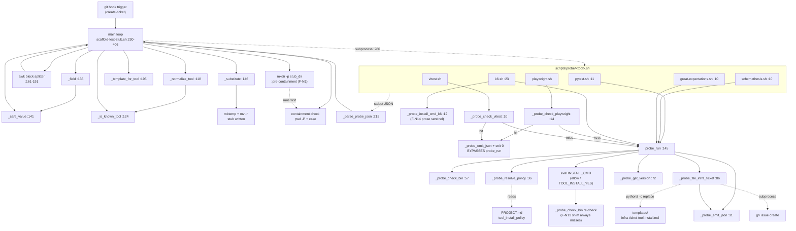
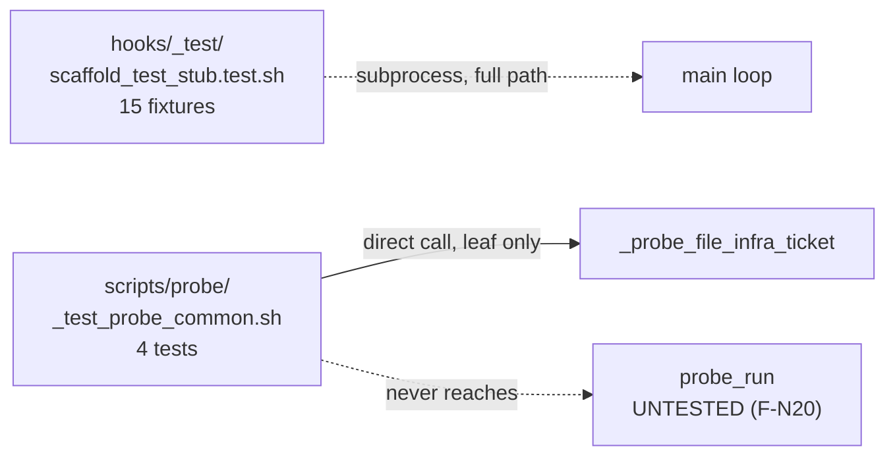

# Fact Sheet: current executable-path shell surface (epic #682)

**Ticket:** #683 (investigate step of epic #682)
**Investigated:** 2026-08-31/2026-09-01
**Tier:** Full
**Pinned to:** branch `epic/682-python-executable-path` @ `91d195d`, which merges
`fix/676-sed-substitution-in-probe` (= `feat/662` + the #676 hotfix), `origin/feat/661-scaffold-test-stub-hook` @ `1381371`,
`origin/feat/660-test-stub-templates`, and `origin/feat/663-infra-ticket-template` onto `origin/develop` @ `f811034`.

Every file:line citation below is against that branch. Every repro in this
document was executed in the same session that wrote it.

---

## Prior Knowledge (Phase 0)

- **Ticket body read:** YES -- #683 prescribes the fact-sheet structure and four ACs. #682 (epic) supplies the function checklist and standing orders.
- **Related tickets consulted:** #655 (parent epic), #661, #662, #663, #660, #659, #675 (deferred #672 findings), #676-#680 (#668 P0 sub-tickets), #681 (interim #676 hotfix PR).
- **Prior hostile reviews (authoritative; not re-derived):**
  - PR #672 comment by GPT-5.5 (Round 1): 6 findings -- `1-1`, `1-2`, `1-3`, `1-4`, `2-1`, `2-2`, `9-1`.
  - PR #672 comment by Opus 5 (Round 2, "still-cosmos"): 19 findings -- 5 P0, 8 P1, 6 P2.
  - PR #668 comment by Opus 5 ("noble-pulsar"): 21 findings -- 5 P0, 7 P1, 9 P2. Merge recommendation: HOLD.
- **Recent git history for touched files:**
  - `06e551a feat(#662): tool-availability-probe skill and per-tool probe scripts`
  - `ef237b7 fix(#676): _probe_file_infra_ticket uses python3 str.replace instead of sed`
  - `666f37d feat(#661)` -> `5292825 fix(#661): remediate 6 hostile-review findings from PR #672 Round 1` -> `1381371 fix(#661): remediate Opus 5 Round 2 hostile-review; 15 fixtures pass`
- **Existing documentation:** `skills/tool-availability-probe/SKILL.md` (protocol + output schema + policy), `templates/tests/README.md` (placeholder contract), `templates/infra-ticket-tool-install.md` (placeholder list in its HTML comment header), and the 38-line header comment of `hooks/create-ticket/scaffold-test-stub.sh`.
- **Post-error revisions found:** none in `git log --grep 'Post-error-revision'` for these paths.
- **Solutions catalog:** `solutions/` contains no entry matching "sed substitution", "probe", or "scaffold".

### Prior-art delta

The two hostile reviews were pinned to `666f37d` (#672) and `06e551a` (#668).
Both have since been partially remediated. **The load-bearing new fact this
investigation contributes is which findings are still live at the branch the
rewrite will replace** -- see "Live-defect ledger" below. Findings marked
REMEDIATED are cited so the rewrite does not reintroduce them; findings marked
LIVE are the acceptance surface for the rewrite.

---

## Knowledge Loci

| Entity | Knowledge locus | Current state | Invalidated by epic #682? |
|---|---|---|---|
| Probe protocol (statuses, exit codes, policy) | `skills/tool-availability-probe/SKILL.md` | Documents `installed` / `installed-just-now` / `blocked-on-infra`, exits 0/2/78, `tool_install_policy: allow\|prompt\|block` | YES -- status vocabulary and exit codes are a rewrite deliverable; SKILL.md update is required |
| Automation-block shape | `hooks/create-ticket/scaffold-test-stub.sh:14-28` header comment | Documents `Tool/Layer/Stub/Probe/Ticket-id/AC-id/Feature`, fence-stripping, `^[A-Za-z0-9._-]+$` value rule, allowlist, containment | YES -- header must move to the Python module docstring |
| Stub placeholder contract | `templates/tests/README.md:5-21` | `{ticket_id}`, `{ac_id}`, `{feature}`; plain string replacement, no conditionals | NO -- the rewrite preserves this contract verbatim |
| Infra-ticket placeholders | `templates/infra-ticket-tool-install.md:1-14` (HTML comment) | 7 placeholders; the comment still says "via plain sed substitution" | YES -- that sentence is false since #676; correcting it is a rewrite deliverable |
| Tool->template map | `hooks/create-ticket/scaffold-test-stub.sh:195-213` | Hard-coded `case`; PROJECT.md scanner was deleted in Round-2 | YES -- becomes a data table in the Python module |
| CHANGELOG `[Unreleased]` | `CHANGELOG.md:9-10` | The #661 entry still claims `PROJECT.md` resolution and `sed`-substitution -- both removed by `1381371` | YES -- see finding F-N3 |

---

## Impact Chain

**Task:** replace the shell executable path of epic #655 with Python.

### Upstream (what feeds the code)

| Entity | Location | What it provides | How verified |
|---|---|---|---|
| Ticket body text (untrusted) | stdin or `--body-file` | Semi-structured markdown authored by humans and agents; contains `Automation:` blocks | `scaffold-test-stub.sh:83-94` |
| `templates/tests/*.tmpl` (7 files) | `templates/tests/` | Stub skeletons with 3 placeholders | `ls templates/tests/` -> 7 `.tmpl` + `README.md` |
| `templates/infra-ticket-tool-install.md` | `templates/` | Infra-ticket body with 7 placeholders | `Read`, 44 lines |
| `PROJECT.md` `tool_install_policy` | repo root of **CWD**, not `--repo-root` | `allow` / `prompt` / `block` | `_common.sh:44-48`; **file does not exist in this repo** (`git ls-tree -r --name-only origin/main \| grep -c '^PROJECT\.md$'` -> `0`) |
| Env: `TOOL_INSTALL_POLICY`, `TOOL_INSTALL_YES`, `CRAFT_AGENT_SESSION_DIR` | ambient | Policy override, prompt-consent, requester id | `_common.sh:38, 177, 112` |

### This task (what changes)

- `scripts/probe/_common.sh` (193 lines, 6 functions) -> Python module.
- `scripts/probe/{pytest,playwright,vitest,schemathesis,great-expectations,k6}.sh` (6 files, 11-33 lines) -> thin shims or module entry points.
- `hooks/create-ticket/scaffold-test-stub.sh` (407 lines, 7 functions + awk splitter + main loop) -> Python module.
- `scripts/probe/_test_probe_common.sh` (183 lines, 4 ACs) and `hooks/_test/scaffold_test_stub.test.sh` (557 lines, 15 fixtures) -> pytest.
- **Contracts changed:** the probe->hook JSON contract (status vocabulary, `ticket` key, exit codes) is the one cross-module interface. Any change to it must land on both sides in the same PR.

### Downstream (what consumes the output)

| Consumer | Location | What it expects | Impact |
|---|---|---|---|
| `scaffold-test-stub.sh` main loop | `:283-305` | Single-line JSON on probe stdout with `status` + optional `ticket`; tolerates any exit code (`\|\| true` at `:286`) | The probe rewrite must keep stdout single-line JSON or land simultaneously with the hook rewrite |
| Ticket body reader (human/`gh`) | GitHub issue body | `Generated stubs:` / `Skipped:` / `Blocked-by (from tool-availability probe):` sections | Section names are a user-facing contract; keep verbatim |
| Generated stub files | `$REPO_ROOT/<Stub>` | Must fail loudly and name ticket+AC+feature | `templates/tests/README.md:19-21` |
| `gh issue create` | GitHub API | Public repo (`gh repo view --json visibility` -> `PUBLIC`) | Every escalation is a public artifact; dedupe and path-leak defects are externally visible |
| No other consumer | -- | `grep -rn 'scripts/probe\|scaffold-test-stub' --include='*.sh' --include='*.md' .` finds only the hook, the two test files, `CHANGELOG.md`, and the two SKILL/README docs | Blast radius is contained to this epic |

---

## Files in scope

| File | Lines | Purpose | Dependencies |
|---|---|---|---|
| `scripts/probe/_common.sh` | 193 | Shared probe helper: check -> install -> escalate | `git`, `gh`, `python3`, `grep`, `sed`, `command -v`, `eval` |
| `scripts/probe/pytest.sh` | 11 | pytest wrapper | `_common.sh` |
| `scripts/probe/schemathesis.sh` | 10 | schemathesis wrapper | `_common.sh` |
| `scripts/probe/great-expectations.sh` | 10 | great-expectations wrapper | `_common.sh` |
| `scripts/probe/playwright.sh` | 33 | playwright wrapper w/ own detector | `_common.sh`, `npx` |
| `scripts/probe/vitest.sh` | 26 | vitest wrapper w/ own detector | `_common.sh`, `npx` |
| `scripts/probe/k6.sh` | 23 | k6 wrapper w/ OS-dependent install cmd | `_common.sh`, `uname`, `brew`/`apt-get` |
| `hooks/create-ticket/scaffold-test-stub.sh` | 407 | Ticket-body -> rendered stubs + footer | `python3`, `awk`, `grep`, `sed`, `mktemp`, `mv`, the six probes |
| `scripts/probe/_test_probe_common.sh` | 183 | 4 ACs for the #676 substitution fix | `bash`, stub `gh`, `git` |
| `hooks/_test/scaffold_test_stub.test.sh` | 557 | 15 fixtures for the hook | `bash`, sandbox dirs |

Both suites are green on the pinned branch: `bash scripts/probe/_test_probe_common.sh` -> `Summary: 4 passed, 0 failed`; `bash hooks/_test/scaffold_test_stub.test.sh` -> `Summary: 15 passed, 0 failed`.

---

## Function inventory

Every entry names the same eight attributes: **File**, **Signature**, **Callers**,
**Callees**, **Side effects**, **Known failures**, **Test coverage**,
**Assumptions to verify at rewrite time**.

Severity tags: `LIVE` = reproduced on the pinned branch this session.
`REMEDIATED` = fixed by `5292825`/`1381371`/`ef237b7`, cited so the rewrite does
not reintroduce it. `NEW` = first recorded here.

### _probe_emit_json

- **File:** `scripts/probe/_common.sh:31-34`
- **Signature:** `_probe_emit_json "$compact_json_string"` -> prints to stdout, returns 0. The payload is pre-built by the caller as a bash-interpolated string.
- **Callers:** `_probe_file_infra_ticket:94, 141`, `probe_run:157, 170, 182`, `playwright.sh:26`, `vitest.sh:22`.
- **Callees:** `printf` only.
- **Side effects:** writes one line to stdout. This line is the entire machine-readable interface between the probe layer and the hook layer.
- **Known failures:** it does not build the JSON -- every caller hand-interpolates. `P1-2 (#668) LIVE`: version strings are interpolated unescaped. Repro this session: `ver='unknown option "--version"'; printf '{"status":"installed","tool":"faketool","version":"%s"}\n' "$ver"` produced `{"status":"installed","tool":"faketool","version":"unknown option "--version""}`, and `json.load` raised `JSONDecodeError: Expecting ',' delimiter: line 1 column 68 (char 67)`. The consumer's `_parse_probe_json` swallows the exception and yields an empty status, so the hook sets `probe="unknown"` and the real status is lost.
- **Test coverage:** indirectly asserted by `_test_probe_common.sh:126-129` (`grep -q 'blocked-on-infra'` and `grep -q '"ticket":"https'` against probe stdout). No test feeds a metacharacter-bearing version string. Coverage of the escaping defect: **zero**.
- **Assumptions:** (to verify at rewrite time) that stdout carries exactly one line and nothing else writes to stdout (diagnostics use `>&2` at `:93, 165, 178` -- verified). That the consumer parses with a real JSON parser (it does, `scaffold-test-stub.sh:217-227`). The rewrite must construct payloads with `json.dumps`, never string interpolation, and should cap version-string length.

### _probe_resolve_policy

- **File:** `scripts/probe/_common.sh:36-55`
- **Signature:** `_probe_resolve_policy` -> prints `allow` | `prompt` | `block` | *arbitrary string* on stdout. Takes no arguments; reads `$TOOL_INSTALL_POLICY` and the git root of the **current working directory**.
- **Callers:** `probe_run:162` only.
- **Callees:** `git rev-parse --show-toplevel`, `grep -E '^tool_install_policy:'`, `head -1`, `sed -E`.
- **Side effects:** none (reads only). Reads `$(git rev-parse --show-toplevel)/PROJECT.md`.
- **Known failures:**
  - `P0-4 (#668) LIVE` -- inline comments are not stripped. Repro this session: writing `tool_install_policy: allow  # ephemeral CI runner` to `PROJECT.md` yielded the extracted value `[allow  # ephemeral CI runner]`, and the `case` fell through to `block`. `skills/tool-availability-probe/SKILL.md:85-87` documents exactly this comment-suffixed form, so a user copying the documented line verbatim gets silent `block`.
  - `P2-1 (#668) LIVE` -- CRLF has the same effect; the `sed` at `:48` strips neither `\r` nor trailing whitespace.
  - `P1-6 (#668) LIVE` -- an unrecognised value degrades to `block` with no diagnostic (`probe_run:188`, arm `block|*)`).
  - `P1-4 (#668) LIVE` -- resolves from **CWD**, not from the repo being probed. Repro this session: the hook was invoked with `--repo-root /tmp/e682/p14/targetrepo` (containing both `PROJECT.md` and `templates/`) while CWD was `/tmp/e682/p14/cwdrepo`, a different git repo with neither. The probe read policy from `cwdrepo` and rendered the infra ticket from the **fallback** body -- the captured `gh` body contained the string `Template templates/infra-ticket-tool-install.md not found`.
  - The `|| echo "."` fallback at `:44` silently probes `./PROJECT.md` when outside any git repo.
- **Test coverage:** **zero.** No fixture in either suite sets `PROJECT.md` or `TOOL_INSTALL_POLICY`. `_test_probe_common.sh` calls `_probe_file_infra_ticket` directly, bypassing `probe_run` and therefore policy resolution entirely.
- **Assumptions:** (to verify at rewrite time) that `PROJECT.md` exists at all -- it does **not** in this repo (`ls PROJECT.md` reports no such file; counting `^PROJECT\.md$` in `git ls-tree -r --name-only origin/main` returns `0`), so `block` is the *normal* path, not an edge case. That the policy file format is a flat `key: value` line rather than nested YAML (SKILL.md:84-88 shows flat). That the rewrite takes an explicit repo-root parameter instead of inferring one from CWD.

### _probe_check_bin

- **File:** `scripts/probe/_common.sh:57-70`
- **Signature:** `_probe_check_bin BIN_NAME [MODULE_NAME]` -> exit 0 if present, 1 if absent. No stdout.
- **Callers:** `probe_run:154` (pre-check), `probe_run:167` and `:179` (post-install re-check).
- **Callees:** `command -v`, `python3 -c "import $module"`.
- **Side effects:** spawns `python3` when `MODULE_NAME` is set. `python3 -c "import $module"` interpolates `$module` into Python source -- safe today because all six module names are literals in the wrappers, but it is an injection shape that the rewrite should close by construction.
- **Known failures:**
  - `P1-1 (#668) LIVE` -- returns success when the *module* imports but the *binary* is absent; `_probe_get_version` then shells out to the missing binary. Repro this session produced `{"status":"installed","tool":"great-expectations","version":"v.sh: line 3: great_expectations: command not found"}` with `rc=0`. This is the expected outcome of this PR's own `pip install --user` commands, whose console scripts land in `~/.local/bin`, absent from stock macOS `PATH`.
  - `P0-3 (#668) LIVE` -- `probe_run` reuses the same `BIN_NAME` for the post-install re-check, so the `__playwright_absent__` sentinel at `playwright.sh:33` and `__vitest_absent__` at `vitest.sh:26` make the re-check fail unconditionally. Verified this session: both sentinels are present, and searching `_common.sh` for `CHECK_FN` or `check_fn` returns no match -- there is no injectable detector.
  - `P2-5 (#668) LIVE` -- `command -v` matches shell functions and aliases, not only executables.
- **Test coverage:** **zero** direct coverage. The only exercise is incidental: the hook fixtures stub the whole probe script.
- **Assumptions:** (to verify at rewrite time) that "installed" means *invocable as a subprocess by the test runner*, not merely "importable". The rewrite must record **how** the tool is invocable (`via: "bin"` versus `via: "module"`) so the hook can render `python3 -m pytest` when the console script is missing. Detection must be injectable per tool so the npx-based tools stop needing sentinels.

### _probe_get_version

- **File:** `scripts/probe/_common.sh:72-84`
- **Signature:** `_probe_get_version BIN_NAME` -> prints a version string (or the literal `unknown`) on stdout; always returns 0.
- **Callers:** `probe_run:156, 169, 181`.
- **Callees:** `"$bin" --version`, then `"$bin" -v`, `head -1`.
- **Side effects:** **executes an arbitrary binary named by the caller, with no time limit.** Folds stderr into the value via `2>&1` at `:76` and `:78`.
- **Known failures:** `P1-1 (#668) LIVE` -- stderr is merged into the version string, so shell error text becomes the reported version (repro above). `P1-2 (#668) LIVE` -- the returned string flows unescaped into JSON. No time-box anywhere: searching `_common.sh` for `timeout` returns `0` matches, and the hook adds none.
- **Test coverage:** **zero.**
- **Assumptions:** (to verify at rewrite time) that `--version` is safe to run (it invokes third-party code). That version output is a single line (many tools print banners). The rewrite should separate stdout from stderr, time-box the call, truncate the result, and represent failure as `version: null` rather than as an error string.

### _probe_file_infra_ticket

- **File:** `scripts/probe/_common.sh:86-143`
- **Signature:** `_probe_file_infra_ticket TOOL [LAYER] INSTALL_CMD [BLOCKING]` -> emits JSON and **calls `exit`** (2 when `gh` is missing, 78 otherwise). Never returns to its caller.
- **Callers:** `probe_run:174, 186, 189` -- all three policy arms converge here.
- **Callees:** `command -v gh`, `git rev-parse --show-toplevel`, `basename`, `python3` (template substitution, post-#676), the `gh` issue-creation subcommand, `_probe_emit_json`.
- **Side effects:** **creates a public GitHub issue.** Writes diagnostics to stderr. Reads `templates/infra-ticket-tool-install.md` from the CWD's git root.
- **Known failures:**
  - `P0-1 (#668) REMEDIATED` by `ef237b7` -- `sed` replaced with `python3` `str.replace` at `:106-131`. Verified: extracting the function body with `awk` and counting lines beginning with `sed ` returns `0`; `_test_probe_common.sh` ACs 2-4 pass.
  - `P0-2 (#668) LIVE` -- `local url` on `:139` followed by a separate assignment on `:140` makes the `gh` call subject to `set -e`; a failing `gh` (unauthenticated, offline, missing label, rate-limited) aborts the script before `_probe_emit_json` runs. Empty stdout drives the hook's `:292` branch to `probe="unknown"`, nothing is appended to `BLOCKED_BY`, and the ticket renders green for a tool that is missing with no infra ticket filed. `2>/dev/null` at `:140` discards the reason.
  - `P0-5 (#668) LIVE` -- no duplicate suppression. Searching `_common.sh` for an issue-listing call returns no match. The hook probes once per Automation block, so N ACs naming one tool file N public issues.
  - `P1-5 (#668) LIVE` -- the `gh`-missing path at `:92-95` emits status `blocked-on-infra` with ticket `unfilable-gh-missing`. The hook branches on status plus non-empty ticket (`:303`), so the sentinel is rendered verbatim as a `Blocked-by:` bullet. A failure returned in the shape of a success.
  - `P2-4 (#668) LIVE` -- `:112` substitutes `${CRAFT_AGENT_SESSION_DIR}`, an absolute local filesystem path, into a **public** issue body (`gh repo view --json visibility` returns `PUBLIC`). The template's own documentation asks for a session *id* (`templates/infra-ticket-tool-install.md:13`).
  - `P2-6 (#668) LIVE` -- an empty `$blocking` yields the title `infra: install pytest for ` with a trailing space and a dangling preposition, which also defeats title-based dedupe.
  - `P1-4 (#668) LIVE` -- the template is resolved from CWD, not from the probed repo (repro recorded under `_probe_resolve_policy`).
  - `P2-7 (#668) LIVE` -- calls `exit` from a sourced helper, so `_common.sh` cannot probe several tools in one process.
- **Test coverage:** `scripts/probe/_test_probe_common.sh` is dedicated to this function: AC1 (no `sed` remains), AC2 (`&&` renders literally), AC3 (`|` does not abort; exit 78; ticket URL present), AC4 (byte-identity with the legacy `sed` render on metacharacter-free input). It stubs `gh` and writes its own template. **It does not cover:** `gh` failure, `gh` absence, dedupe, the session-path leak, empty `blocking`, or repo-root divergence.
- **Assumptions:** (to verify at rewrite time) that filing is idempotent per (tool, blocking-ticket) -- it is not. That `gh` targets the correct repository -- it resolves by CWD, not by an explicit repo argument. That the emitted JSON is the only thing on stdout -- the issue-creation call prints the URL, which is why `:140` pipes through `tail -1`; any additional `gh` chatter would corrupt the captured URL.

### probe_run

- **File:** `scripts/probe/_common.sh:145-192`
- **Signature:** `probe_run TOOL_NAME BIN_NAME INSTALL_CMD [MODULE_NAME] [LAYER] [BLOCKING_TICKET]` -> emits JSON and **calls `exit`** on every path (0, 2, or 78). Never returns.
- **Callers:** all six wrappers -- `pytest.sh:11`, `schemathesis.sh:10`, `great-expectations.sh:10`, `k6.sh:23`, `playwright.sh:33`, `vitest.sh:26`.
- **Callees:** `_probe_check_bin`, `_probe_get_version`, `_probe_emit_json`, `_probe_resolve_policy`, `eval "$install_cmd"`, `_probe_file_infra_ticket`.
- **Side effects:** **`eval`s an install command** (`:166`, `:179`) with all output discarded to `/dev/null`; may install software, invoke `sudo`, and reach the network. May create a public GitHub issue via its callee.
- **Known failures:**
  - `P0-3 (#668) LIVE` -- the post-install re-check at `:167` and `:179` reuses `BIN_NAME`, defeating the playwright and vitest sentinels: a *successful* install is reported as absent and files a spurious public issue on every run under `tool_install_policy: allow`, the policy SKILL.md:93 recommends for CI runners.
  - `P1-3 (#668) LIVE` -- `eval "$install_cmd"` has no time-box, and the consumer adds none (`scaffold-test-stub.sh:286` invokes the probe with `|| true` and no `timeout`). `k6.sh:16` calls `gpg --recv-keys` against a public keyserver; `playwright.sh:33` runs `npx playwright install --with-deps`. Output goes to `/dev/null`, so a hang is indistinguishable from slowness.
  - `P1-6 (#668) LIVE` -- the `block|*)` arm at `:188` swallows invalid policy values silently.
  - `P1-7 (#668) LIVE` -- the blocking-ticket argument is unvalidated by every wrapper (`"${1:-}"`) and flows into the issue title at `:140`; a newline splits the title. The hook happens to constrain it via `_safe_value`, but SKILL.md:64-69 documents the probes as directly invocable.
  - `P2-8 (#668) LIVE` -- proxy and index environment (`PIP_INDEX_URL`, `NPM_CONFIG_REGISTRY`, `HTTP_PROXY`) is inherited and undocumented; install-failure output is discarded.
  - `P2-2 (#668) LIVE` -- `k6.sh:18` returns English prose as the "install command", which reaches `eval`. It fails with `command not found` today, which is the right outcome by accident.
- **Test coverage:** **zero direct coverage.** `_test_probe_common.sh` bypasses `probe_run` entirely. The hook suite stubs the whole probe script. None of the status/exit combinations in the SKILL.md output-schema table is asserted end-to-end.
- **Assumptions:** (to verify at rewrite time) that `eval` is required at all -- it is not; install commands can be argv lists, which removes the k6-prose hazard and P1-7 in one move. That exiting from a library function is acceptable -- it is not, if the hook is to cache one probe result per tool per run, which P0-5's remediation requires. That the same detector is valid before and after install -- it is not, for the npx-based tools.

### _field

- **File:** `hooks/create-ticket/scaffold-test-stub.sh:135-139`
- **Signature:** `_field BLOCK FIELD_NAME` -> prints the field's value (empty string when absent); always exits 0 because the pipeline is wrapped in `{ ...; } || true`.
- **Callers:** main loop, `:241-248` -- seven calls per block (`Tool`, `Layer`, `Stub`, `Probe`, `Ticket-id`, `AC-id`, `Feature`).
- **Callees:** `echo`, `grep -E "^${field}:[[:space:]]"`, `head -1`, `sed -E`.
- **Side effects:** none. Spawns three processes per call, so 21 processes per Automation block.
- **Known failures:**
  - `#672 P0-1 / 1-1 REMEDIATED` by `5292825` -- the `|| true` wrapper at `:138` stops `grep`'s no-match status from aborting the script under `set -euo pipefail`. This was the finding that made the entire probe-invocation path dead code; `test_auto_probe_installed` and `test_auto_probe_blocked_real_json` now exercise it.
  - `#672 P2-3 LIVE` -- `^${field}:[[:space:]]` still requires whitespace after the colon. Repro this session: a block containing `Tool:pytest` produced `Skipped:` / `- (missing Tool or Stub)`, a message that misattributes the cause (the field is present).
  - `NEW (F-N2) LIVE` -- `$field` is interpolated into a `grep -E` pattern and a `sed -E` expression. Field names are literals today, so this is latent, not live; it is recorded so the rewrite does not carry the shape forward.
  - Multi-line field values are impossible by construction (`head -1`), which the Automation-block format assumes but never states.
- **Test coverage:** exercised by all 15 hook fixtures indirectly. No fixture asserts absence-tolerance directly; the two auto-probe fixtures cover it as a side effect of omitting `Probe:`. No fixture covers `Tool:pytest` (colon-no-space).
- **Assumptions:** (to verify at rewrite time) that a block is a flat `Key: value` list with unique keys -- duplicates are silently resolved by `head -1` with no diagnostic. That values never contain a leading `#` or trailing comment (nothing strips them, unlike `_probe_resolve_policy` which needs to). The rewrite should parse a block once into a dict rather than re-scanning it seven times.

### _safe_value

- **File:** `hooks/create-ticket/scaffold-test-stub.sh:141-144`
- **Signature:** `_safe_value VALUE` -> exit 0 if `VALUE` matches `^[A-Za-z0-9._-]+$`, else 1. No stdout.
- **Callers:** main loop `:265` (for `Ticket-id`, `AC-id`, `Feature`) and `:277` (for `Layer`).
- **Callees:** bash `[[ =~ ]]` only.
- **Side effects:** none.
- **Known failures:**
  - `#672 P0-3 / 2-2 REMEDIATED` by `5292825` -- this allowlist is the guard that made `&` in a `Feature` value harmless. Combined with the move from `sed` to bash parameter expansion in `_substitute`, the silent-corruption class is closed. Covered by `test_sed_metachars_rejected`.
  - `NEW (F-N4) LIVE` -- the allowlist is applied to `Ticket-id`, `AC-id`, `Feature`, and `Layer`, but **not** to `Stub` (only path containment guards it) and **not** to `Tool` (the `KNOWN_TOOLS` allowlist guards it). That split is correct but undocumented; the header comment at `:25` says "Substitution values must match `^[A-Za-z0-9._-]+$`" without naming which fields are substitution values.
  - `NEW (F-N26) LIVE` -- the allowlist admits `.`, `_` and `-`, but `Feature` and `AC-id` are substituted into a Python identifier at `templates/tests/pytest-unit.py.tmpl:15`. Repro executed on this branch: `Feature: has-hyphen` rendered `tests/test_ac1_has-hyphen.py`, and `python3 -m py_compile` returned `SyntaxError: expected '('`. The assumption noted below was true and should have been recorded as a finding; the PR #684 hostile review (2-1) promoted it.
  - The regex admits a leading `-`, so a `Feature` of `-rf` is "safe" here and only becomes harmless because no value is ever passed as an argv element to another command.
- **Test coverage:** `test_sed_metachars_rejected` (`hooks/_test/scaffold_test_stub.test.sh:309`) covers rejection of `&`-bearing values. No fixture covers a leading-dash value or a value containing `/`.
- **Assumptions:** (to verify at rewrite time) that the same character class is right for all four fields -- `Feature` becomes a Python identifier in the pytest templates, so `.` and `-` produce syntactically invalid Python (`def test_ac1_a-b()`). The rewrite should validate per-field against the target language's identifier rules, not with one shared class.

### _substitute

- **File:** `hooks/create-ticket/scaffold-test-stub.sh:146-152`
- **Signature:** `_substitute STRING` -> prints `STRING` with `{ticket_id}`, `{ac_id}`, `{feature}` replaced. Reads the globals `SUB_TICKET_ID`, `SUB_AC_ID`, `SUB_FEATURE` set at `:321-323`.
- **Callers:** main loop `:324` (the `Stub` path) and `:349` (the template contents).
- **Callees:** bash parameter expansion `${s//pattern/replacement}` only -- no external process.
- **Side effects:** none.
- **Known failures:**
  - `#672 P0-3 / 2-2 REMEDIATED` -- `sed` is gone; bash pattern substitution treats the replacement as data, so `&` no longer expands to the match.
  - `#672 1-3 REMEDIATED` -- placeholders are now expanded into the `Stub` *path* as well as the template body. Covered by `test_stub_path_placeholders`.
  - `NEW (F-N5) LIVE` -- the caller wraps this in a command substitution (`rendered=$(_substitute "$tmpl_content")` at `:349`) and writes with `printf '%s'` at `:351`, so **every generated stub loses its trailing newline.** Repro this session: `templates/tests/pytest-unit.py.tmpl` ends with byte `0a`; the rendered `tests/t.py` ends with byte `22` (`"`). Every generated file is missing its final newline -- a lint failure in most Python and TypeScript toolchains and a `\ No newline at end of file` marker in every future diff.
  - Communicates through three global variables rather than parameters, so it cannot be called for two blocks concurrently and its contract is invisible at the call site.
- **Test coverage:** `test_happy_path`, `test_stub_path_placeholders`, `test_layer_selects_integration`, `test_no_zero_byte_stub` all render through it. **No fixture asserts the trailing byte of a generated stub**, which is why F-N5 survived 15 green fixtures.
- **Assumptions:** (to verify at rewrite time) that placeholders are exactly the three documented in `templates/tests/README.md:9-13` -- verified, all seven templates use only those. That an unrecognised `{placeholder}` should survive verbatim (current behavior) rather than raise. The rewrite must preserve template bytes exactly, including the trailing newline.

### _normalize_tool

- **File:** `hooks/create-ticket/scaffold-test-stub.sh:118-122`
- **Signature:** `_normalize_tool TOOL` -> prints `TOOL` with every `_` replaced by `-`.
- **Callers:** main loop `:256`, immediately before the allowlist check.
- **Callees:** bash parameter expansion only.
- **Side effects:** none.
- **Known failures:** `#672 P1-4 REMEDIATED` by `1381371` -- normalization now happens once and the normalized value feeds all three downstream lookups (allowlist `:257`, probe-script path `:284`, template map `:308`). Before the fix, only the template fallback normalized, so `Tool: great_expectations` hit the template but missed the probe.
- **Test coverage:** `test_tool_normalization` (`hooks/_test/scaffold_test_stub.test.sh:431`) asserts `Tool: great_expectations` resolves.
- **Assumptions:** (to verify at rewrite time) that the canonical form is dash-separated -- verified against the six script filenames (`great-expectations.sh`) and the `KNOWN_TOOLS` string at `:116`. That the mapping is one-way and total: `pytest` -> `pytest` is a no-op, and no canonical tool name contains an underscore, so the transform is idempotent. Verified by inspection of all six names.

### _is_known_tool

- **File:** `hooks/create-ticket/scaffold-test-stub.sh:124-131`
- **Signature:** `_is_known_tool TOOL` -> exit 0 if `TOOL` is a word in `$KNOWN_TOOLS` (`:116`), else 1.
- **Callers:** main loop `:257`.
- **Callees:** bash word-splitting over the unquoted `$KNOWN_TOOLS` in a `for` loop.
- **Side effects:** none.
- **Known failures:** `#672 latent-tool-traversal REMEDIATED` by `1381371` -- this is the gate that stops `Tool: ../../../x` from composing into the probe-script path at `:284` (which is executed at `:286`). The review flagged it as becoming a live arbitrary-execution path the moment P0-1 was fixed; both changes landed in the same series, so the window never opened on a merged branch.
- **Test coverage:** `test_unknown_tool_rejected` (`:364`) asserts an unknown tool is skipped and surfaced in the `Skipped:` section.
- **Assumptions:** (to verify at rewrite time) that the allowlist is the single source of truth for which tools exist. It is currently duplicated in three places that must stay in sync -- `KNOWN_TOOLS` at `:116`, the `case` in `_template_for_tool` at `:198-212`, and the six filenames under `scripts/probe/`. Verified this session that all three agree today; the rewrite should derive all three from one table.

### _template_for_tool

- **File:** `hooks/create-ticket/scaffold-test-stub.sh:195-213`
- **Signature:** `_template_for_tool TOOL [LAYER]` -> prints a repo-relative template path, or empty for an unknown tool.
- **Callers:** main loop `:308`.
- **Callees:** none (pure `case` + `printf`).
- **Side effects:** none.
- **Known failures:**
  - `#672 P1-3 REMEDIATED by deletion` -- the ~40-line `PROJECT.md` YAML scanner was removed in `1381371` because `PROJECT.md` exists on no branch and the scanner was therefore untestable and 0% covered. Verified this session: no `PROJECT.md` in `origin/main` or `HEAD`.
  - `#672 P1-4 REMEDIATED` -- `Layer: integration` now selects `pytest-integration.py.tmpl`; covered by `test_layer_selects_integration`.
  - `NEW (F-N6) LIVE` -- layer disambiguation exists only for `pytest`. The other five tools ignore `Layer` entirely, so `Tool: playwright` + `Layer: nonsense` silently renders the e2e template. Nothing is surfaced into `Skipped:`.
  - `NEW (F-N7) LIVE` -- the mapping hard-codes repo-relative paths, so a consuming repo cannot supply its own templates. `templates/tests/README.md:44` instructs template authors to register new templates in `skills/testing-frameworks/SKILL.md`, but nothing reads that file. The registration instruction is inert.
- **Test coverage:** `test_happy_path` (pytest/unit), `test_layer_selects_integration` (pytest/integration), `test_tool_normalization` (great-expectations). Four of the six tools have no template-resolution fixture.
- **Assumptions:** (to verify at rewrite time) that all seven templates exist at the mapped paths -- verified this session, `templates/tests/` contains exactly the seven `.tmpl` files named in `templates/tests/README.md:27-33`. That a missing template should skip rather than fail (current behavior, `:315-318`). The rewrite should make the tool->(layer->template) map a data structure and expose it for testing.

### _parse_probe_json

- **File:** `hooks/create-ticket/scaffold-test-stub.sh:215-228`
- **Signature:** `_parse_probe_json JSON_STRING` -> prints exactly two lines: the `status` value, then the `ticket` value. Both empty on any parse failure. Always exits 0.
- **Callers:** main loop `:288`.
- **Callees:** `python3 -c`, reading the payload from the `PROBE_JSON` environment variable (not from argv -- correct, since the payload is untrusted).
- **Side effects:** spawns one `python3` per probed block.
- **Known failures:**
  - `#672 P0-5 / 1-2 REMEDIATED` by `1381371` -- the probe JSON is now parsed as JSON and `ticket` is read as its own key, replacing the prefix-stripping that could never produce a `Blocked-by` line. Verified end-to-end this session: the hook, run against an absent tool with a stubbed `gh`, emitted `Blocked-by (from tool-availability probe):` followed by the real issue URL. `test_auto_probe_blocked_real_json` covers it.
  - `LIVE (inherited)` -- the bare `except Exception` at `:224` converts every malformed payload into `status=""`, which the caller turns into `probe="unknown"` at `:293`, which nothing acts on. `#668 P1-2` (unescaped version strings) reaches the hook through exactly this path, so a probe that correctly reports `installed` can be silently downgraded to `unknown` by a quote in a version banner.
  - A payload whose `ticket` value contains a newline would emit three lines, and the caller's `sed -n '2p'` at `:290` would take only the first fragment. Nothing upstream forbids it.
- **Test coverage:** `test_auto_probe_installed` and `test_auto_probe_blocked_real_json` supply well-formed JSON from a stub probe. **No fixture supplies malformed JSON, empty stdout, or a multi-line payload** -- the three failure modes.
- **Assumptions:** (to verify at rewrite time) that the probe emits exactly one JSON object on stdout. That `status` and `ticket` are the only keys the hook needs -- the rewrite will need `via` (bin vs module, per `#668 P1-1`) and a distinct `escalation-failed` status (per `#668 P1-5`), so the contract must be versioned and changed on both sides at once.

### awk block splitter

- **File:** `hooks/create-ticket/scaffold-test-stub.sh:161-191`, feeding the fence-stripper at `:96-102` and consumed by the main loop's `while` at `:235-372`
- **Signature:** reads `$STRIPPED_BODY` on stdin; writes each Automation block to `$BLOCKS_FILE`, each terminated by a literal `---END-BLOCK---` line. No exit status is checked.
- **Callers:** top-level, once per invocation.
- **Callees:** `awk`; upstream, a `python3` regex that removes fenced code blocks (`:97-102`).
- **Side effects:** writes `$SCRATCH_DIR/blocks.txt`. `SCRATCH_DIR` is created at `:156` and `rm -rf`'d by an `EXIT` trap at `:157`.
- **Known failures:**
  - `#672 P1-1 / 1-4 REMEDIATED` by `5292825` -- fenced blocks are stripped before parsing, so documentation examples no longer scaffold files. Covered by `test_fenced_ignored`. The stripper handles both ` ``` ` and `~~~` fences.
  - `#672 P1-5 REMEDIATED` -- `TMPDIR` was renamed to `SCRATCH_DIR`, so the hook no longer clobbers the exported `TMPDIR` its children inherit and then deletes it. Covered by `test_tmpdir_not_clobbered`.
  - `#672 P1-2 PARTIALLY REMEDIATED` -- `: > "$BLOCKS_FILE"` at `:159` removes the "No such file" stderr noise, but a malformed `Automation: pytest` line still passes the guard at `:105` (unanchored `^Automation:`) while matching nothing in the splitter's `^Automation:[[:space:]]*$`. The result is exit 0, an unchanged body, and **no diagnostic naming the offending line**.
  - `NEW (F-N8) LIVE` -- the block delimiter `---END-BLOCK---` is an in-band sentinel. A ticket body containing a literal `---END-BLOCK---` line inside an Automation block would split that block in two. Nothing escapes or rejects it.
  - `NEW (F-N9) LIVE` -- `$BLOCKS_FILE` is interpolated into the awk program text at `:165, 166, 174, 175, 187, 188` rather than passed via `-v`. The value comes from `mktemp` so it is safe today, but it is the same "shell value inside another language's source" shape the epic exists to eliminate.
  - Blocks are terminated by a blank line or by a new `Automation:` line; a block that runs to EOF is handled by the `END` rule. A block interrupted by a markdown heading is *not* terminated -- the heading is absorbed as a field line and then silently ignored by `_field`.
- **Test coverage:** `test_fenced_ignored`, `test_noop`, `test_tmpdir_not_clobbered`, and all rendering fixtures. **No multi-block fixture exists** -- the self-review named this gap at `plans/self-review-661.md:41` and the Round-2 review confirmed multi-block is the one untested path that works. No fixture covers the malformed-`Automation:` line or the in-band sentinel.
- **Assumptions:** (to verify at rewrite time) that fences are the only markdown construct that can produce a false-positive block -- indented (4-space) code blocks are *not* stripped and would still scaffold. That the body is small enough to hold in memory three times (`BODY`, `STRIPPED_BODY`, `BLOCKS_FILE`). The rewrite should return a list of dicts from one pass with no temp file and no in-band delimiter.

### main loop

- **File:** `hooks/create-ticket/scaffold-test-stub.sh:230-406` (per-block body `:235-372`; footer assembly `:374-406`)
- **Signature:** reads `$BLOCKS_FILE`; accumulates `GENERATED`, `SKIPPED`, `BLOCKED_BY`; writes the original body plus a footer to `$OUT_FILE` or stdout; exits 0.
- **Callers:** top-level. The hook itself is invoked by `[skill:create-ticket]` with `--stdin` or `--body-file`.
- **Callees:** `_field`, `_normalize_tool`, `_is_known_tool`, `_safe_value`, `_substitute`, `_template_for_tool`, `_parse_probe_json`, the six probe scripts (`:286`), `mkdir -p`, `mktemp`, `mv -n`, `dirname`, `basename`, `cd`/`pwd -P`.
- **Side effects:** **creates directories and files under `$REPO_ROOT_ABS`**; **executes `scripts/probe/<tool>.sh`**, which can install software and file public GitHub issues; writes the transformed ticket body.
- **Known failures:**
  - `#672 P0-2 / 2-1 REMEDIATED` by `5292825` -- path containment at `:327-339` canonicalizes via `cd`/`pwd -P` and refuses to write outside `$REPO_ROOT_ABS`. Covered by `test_path_traversal_rejected`.
  - `#672 P0-4 REMEDIATED` by `1381371` -- atomic write via `mktemp` in the destination directory plus `mv -n` at `:350-361` replaced the truncate-then-`sed` pattern that left zero-byte stubs. Covered by `test_no_zero_byte_stub`.
  - `#672 P1-8 REMEDIATED` -- `mv -n` is the TOCTOU primitive; a losing racer is recorded as `Skipped:` (`:357-360`).
  - `#672 P1-6 PARTIALLY REMEDIATED` -- a `SKIPPED` array now surfaces most degraded outcomes into the body. But `probe="probe-missing"` (`:296`) and `probe="unknown"` (`:293`) are still computed and never read: a block whose probe script is absent, or whose probe emitted unparseable JSON, renders a stub with no warning anywhere. The suite's own fixture name concedes this -- `test_probe_missing_surfaced` passes with the message "probe-missing not yet fully surfaced; see follow-up".
  - `#672 P1-7 LIVE` -- the documented exit code 3 is never emitted. Verified this session: `grep -n 'exit 3'` on the file returns no matches, while the header at `:37` still reserves it.
  - `NEW (F-N1) LIVE` -- `mkdir -p "$stub_dir"` at `:329` runs **before** the containment check at `:332`. Repro this session: a block with `Stub: ../../ESCAPED_DIR/t.py` was correctly refused (`Skipped: - ../../ESCAPED_DIR/t.py (path escapes repo root)`, exit 0) **but the directory `/tmp/e682/ESCAPED_DIR` was created outside the repo root**. Attacker-controlled directory creation at an arbitrary path, no file contents. The containment check must precede any filesystem mutation.
  - `#672 P2-6 LIVE` -- `BODY=$(cat)` at `:84`/`:90` strips trailing newlines from the ticket body, so a body ending in blank lines is silently reflowed.
  - `#672 P2-4 REMEDIATED` -- each footer section now carries its own `\n\n` separator (`:378, 385, 392`).
  - `#672 P2-5 REMEDIATED` -- `--body-file`/`--out-file`/`--repo-root` with no value now exit 2 (`:48-65`).
  - `NEW (F-N10) LIVE` -- the probe is invoked once per Automation block (`:286`), with no per-run cache. This is the consumer half of `#668 P0-5`: five pytest-backed ACs on a machine without pytest file five public issues. `#668`'s review explicitly assigned per-run caching to this side.
  - `NEW (F-N11) LIVE` -- `probe_json=$("$probe_script" "$ticket_id" 2>/dev/null || true)` at `:286` discards both the probe's stderr and its exit code. The probe's carefully distinguished exits (0 / 2 / 78) are unobservable to the hook, which is why `#668 P1-5`'s `unfilable-gh-missing` sentinel cannot be told apart from a real ticket.
  - `NEW (F-N27) LIVE` -- `Layer:` is parsed and used for template selection, then dropped: the probe is invoked as `"$probe_script" "$ticket_id"` at `:286` with no layer argument. Every infra ticket the probe files carries the wrapper's hard-coded layer instead of the AC's. Found by the PR #684 hostile review (2-2).
- **Test coverage:** all 15 fixtures in `hooks/_test/scaffold_test_stub.test.sh` drive this loop. **Uncovered:** multi-block bodies, exit-code assertions on failure paths, a body with no trailing newline, `probe-missing` actually surfacing, per-run probe caching, and the pre-containment `mkdir`.
- **Assumptions:** (to verify at rewrite time) that the ticket body is the authoritative input and the filesystem is the output -- i.e. that a partial failure should still emit a body (current behavior; correct). That rendering is idempotent -- it is, via the `-e` check at `:341` plus `mv -n`, but "already exists" is indistinguishable from "we generated it last run". That `$REPO_ROOT_ABS` is trustworthy -- it is caller-supplied and never validated as a git repository.

### pytest.sh

- **File:** `scripts/probe/pytest.sh:1-11` (11 lines; single `probe_run` call at `:11`)
- **Signature:** executable script; `scripts/probe/pytest.sh [BLOCKING_TICKET]`. No functions defined. Delegates entirely to `probe_run "pytest" "pytest" "python3 -m pip install --user pytest" "pytest" "backend" "${1:-}"`.
- **Callers:** `hooks/create-ticket/scaffold-test-stub.sh:286` (main loop, via `"$REPO_ROOT/scripts/probe/${tool}.sh"`); humans on the command line; `scripts/probe/_test_probe_common.sh` does **not** call it (it calls `_probe_file_infra_ticket` directly).
- **Callees:** `source _common.sh:1-193` -> `probe_run:145`. Transitively `_probe_check_bin:57`, `_probe_get_version:72`, `_probe_resolve_policy:36`, `_probe_emit_json:31`, `_probe_file_infra_ticket:86`.
- **Side effects:** stdout JSON; exit 0 / 2 / 78 per `probe_run`. Under `tool_install_policy: allow`, `eval`s the pip install string, mutating the user's `--user` site-packages. Under `block`/failed-install, creates a GitHub issue.
- **Known failures:** inherits every LIVE `_common.sh` defect (#668 P0-2, P0-3, P0-4, P0-5, P1-1..P1-7). Wrapper-specific: none -- this is the reference shape all six *should* have had.
- **Test coverage:** none direct. `hooks/_test/scaffold_test_stub.test.sh` fixture `test_auto_probe_installed` exercises this script end-to-end but only on the installed path (pytest is present in CI and on the dev box), so the absent/install/escalate branches are never reached through this wrapper.
- **Assumptions:** (a) the binary name, the import/version name, and the canonical tool name are all the literal string `pytest`; (b) `python3 -m pip install --user` is an acceptable mutation on a shared machine; (c) layer is always `backend` regardless of what the calling ticket's AC actually declares -- the hook passes no layer through, so a pytest stub scaffolded for an `integration` AC still files an infra ticket labelled `backend`.

### playwright.sh

- **File:** `scripts/probe/playwright.sh:1-33`
- **Signature:** executable script; `scripts/probe/playwright.sh [BLOCKING_TICKET]`. Defines one local function `_probe_check_playwright()` at `:14-22` (no args; returns 0 if found, 1 if not). Terminal call `probe_run "playwright" "__playwright_absent__" "npm install -D @playwright/test && npx playwright install --with-deps" "" "e2e" "${1:-}"` at `:33`.
- **Callers:** same as `pytest.sh` -- the hook's main loop at `:286`, and humans.
- **Callees:** `command -v playwright`, `command -v npx`, `npx --no-install playwright --version`; then either `_probe_emit_json:31` directly at `:26`, or `probe_run:145` at `:33`.
- **Side effects:** on the installed branch, writes JSON and `exit 0` at `:27` -- **bypassing `probe_run` entirely**. On the absent branch, hands a deliberately-unfindable shim binary name to `probe_run`, which then runs the npm install under `allow` policy (mutating `node_modules` and downloading browser binaries with `--with-deps`, which on Linux invokes `sudo apt-get`).
- **Known failures:**
  - **F-N12 (NEW, P1).** `:26` interpolates `$ver` into a hand-built JSON string with no escaping. `playwright --version` output containing `"` or `\` produces malformed JSON, which `_parse_probe_json:215` then feeds to `json.loads`, whose bare `except Exception` at `:224` swallows the failure and returns empty strings for both `status` and `ticket`. Same class as #668 P1-2 but in a second location that the #668 review did not enumerate.
  - **F-N13 (NEW, P0).** The `__playwright_absent__` shim defeats `probe_run`'s post-install verification. `probe_run` re-runs `_probe_check_bin "$bin_name"` after `eval "$install_cmd"`; with a shim name that check can never succeed, so a *successful* `npm install -D @playwright/test` is still reported as an install failure and still files an infra ticket. Every `allow`-policy playwright run produces a spurious GitHub issue.
  - **F-N12b.** `:25` `ver=$( (command -v playwright >/dev/null 2>&1 && playwright --version) || npx --no-install playwright --version 2>&1 | head -1 )` -- the `||` binds to the whole pipeline, and `2>&1` on the fallback means stderr is captured as the version string when npx fails partway.
  - Empty `VERSION_BIN` (`""`) at `:33` means `_probe_get_version:72` cannot report a version on the absent path; the infra ticket's `{version_requested}` is always `any`.
- **Test coverage:** none. No fixture in either suite invokes `playwright.sh`. Both branches are untested.
- **Assumptions:** (a) `npx --no-install` is a safe probe (it is not fully -- it can still consult a registry cache and is slow); (b) the two detection paths agree; (c) a project-local install is what the caller wants, so the probe's CWD is the project root -- but the hook does not `cd` before invoking it (#668 P1-4), so the npx lookup runs against whatever directory the git hook inherited.

### vitest.sh

- **File:** `scripts/probe/vitest.sh:1-26`
- **Signature:** executable script; `scripts/probe/vitest.sh [BLOCKING_TICKET]`. Defines `_probe_check_vitest()` at `:10-18`. Terminal `probe_run "vitest" "__vitest_absent__" "npm install -D vitest" "" "frontend" "${1:-}"` at `:26`.
- **Callers:** the hook's main loop at `:286`; humans. Structurally identical to `playwright.sh` -- the file is a copy with the tool name and install command swapped.
- **Callees:** `command -v vitest`, `command -v npx`, `npx --no-install vitest --version`; then `_probe_emit_json:31` at `:22` or `probe_run:145` at `:26`.
- **Side effects:** same shape -- direct `_probe_emit_json` + `exit 0` at `:22-23` on the installed branch, `probe_run` with a shim name at `:26` otherwise.
- **Known failures:** inherits **F-N12** (unescaped `$ver` at `:22`), **F-N12b** (`:21` pipeline/`||` binding), and **F-N13** (`__vitest_absent__` shim defeats post-install verification). The duplication itself is a finding: **F-N15 (NEW, P2)** -- `playwright.sh` and `vitest.sh` are 90% identical, so every defect above exists twice and must be fixed twice; the Python rewrite should express this as one npx-backed detector parameterised by CLI name.
- **Test coverage:** none.
- **Assumptions:** same as `playwright.sh`, plus that `vitest --version` is a cheap no-side-effect invocation (it is; but `npx --no-install vitest --version` on a cold cache is not).

### schemathesis.sh

- **File:** `scripts/probe/schemathesis.sh:1-10`
- **Signature:** executable script; single `probe_run "schemathesis" "schemathesis" "python3 -m pip install --user schemathesis" "schemathesis" "api-contract" "${1:-}"` at `:10`.
- **Callers:** the hook's main loop at `:286` -- **but only if the AC names `schemathesis` as its tool**, and `_is_known_tool:124` must admit it. See F-N4: the hook's allowlist and the wrapper set are maintained independently.
- **Callees:** `probe_run:145` and its transitive callees.
- **Side effects:** identical to `pytest.sh`.
- **Known failures:** inherits all LIVE `_common.sh` defects. Layer string `api-contract` is hyphenated where `templates/tests/README.md:31` calls the layer "API contract" and `skills/testing-frameworks/SKILL.md` uses its own vocabulary -- **F-N16 (NEW, P2)**: the layer token is a free string with three spellings across four files and no single source of truth; the infra ticket's `{layer}` field is therefore not machine-groupable.
- **Test coverage:** none.
- **Assumptions:** binary name == pip distribution name == version-probe name == `schemathesis` (true today).

### great-expectations.sh

- **File:** `scripts/probe/great-expectations.sh:1-10`
- **Signature:** executable script; `probe_run "great-expectations" "great_expectations" "python3 -m pip install --user great-expectations" "great_expectations" "data-pipeline" "${1:-}"` at `:10`.
- **Callers:** the hook's main loop at `:286`; humans.
- **Callees:** `probe_run:145` and its transitive callees.
- **Side effects:** as above.
- **Known failures:** this is the **only** wrapper where the canonical tool name (`great-expectations`, hyphen) differs from the binary name (`great_expectations`, underscore), which makes it the load-bearing case for `_normalize_tool:118`. Repro executed on this branch: `Tool: great-expectations` reaches the absent branch (the module is genuinely not installed here) and produced a rendered infra-ticket body plus a stubbed-`gh` URL -- the repro that established #668 P1-4 (CWD vs `--repo-root` divergence) as LIVE. Inherits all LIVE `_common.sh` defects.
- **Test coverage:** none direct; used as the *vehicle* for the P1-4 repro, not as an assertion.
- **Assumptions:** (a) `_normalize_tool` maps the hyphen form to this filename and nothing else collides; (b) the infra ticket's `command -v {tool}` verification block (`templates/infra-ticket-tool-install.md:34`) is correct -- **it is not**: it renders `command -v great-expectations`, but the installed binary is `great_expectations`. **F-N17 (NEW, P1)**: the generated infra ticket instructs the installer to verify with a command that fails even after a correct install. Only this tool is affected, because only here do the two names diverge.

### k6.sh

- **File:** `scripts/probe/k6.sh:1-23`
- **Signature:** executable script; defines `_probe_install_cmd_k6()` at `:12-20` (no args; echoes an install one-liner). `INSTALL_CMD=$(_probe_install_cmd_k6)` at `:22`; `probe_run "k6" "k6" "$INSTALL_CMD" "" "performance" "${1:-}"` at `:23`.
- **Callers:** hook main loop at `:286`; humans.
- **Callees:** `uname -s`, `command -v brew`, `command -v apt-get`; then `probe_run:145`.
- **Side effects:** the `apt-get` branch at `:16` emits a string containing `sudo gpg`, `sudo tee /etc/apt/sources.list.d/k6.list`, `sudo apt-get update`, `sudo apt-get install -y k6` -- which `probe_run` passes to `eval` under `tool_install_policy: allow`. That is an unattended root-level package-source mutation triggered by a git hook parsing an issue body.
- **Known failures:**
  - **F-N14 (NEW, P1; downgraded from P0 by the PR #684 hostile review, finding 2-3).** `:18` returns the prose string `unsupported-os: please install k6 manually per https://k6.io/docs/getting-started/installation/` on any non-Darwin/non-apt host. That string is not a guard -- it flows into `INSTALL_CMD` and is `eval`ed verbatim under `allow` policy. `eval` splits on the colon-terminated first word and attempts to run a command named `unsupported-os:`; the failure is then reported as an *install failure* (indistinguishable from a real one) rather than as "no install route on this platform". The URL fragment also contains `//` and `:` which are inert here but demonstrate the value was never intended as shell input.
  - The `sudo` chain in `:16` is the single highest-blast-radius line in the whole executable path and has no policy gate distinct from `pip install --user`. `_probe_resolve_policy:36` returns one `allow|prompt|block` token for all tools; there is no per-tool or per-privilege tier. **F-N18 (NEW, P1)**: policy granularity is insufficient for the range of install commands actually shipped (userspace pip ↔ root apt source addition).
  - Empty `VERSION_BIN` at `:23` -- `k6 version` (not `--version`) is the real invocation, so no version can be reported even though k6 is present.
- **Test coverage:** none. Neither the Darwin, apt, nor unsupported-os branch is exercised by any fixture.
- **Assumptions:** (a) exactly three platform cases exist; (b) `brew` on Darwin implies write access to the Homebrew prefix; (c) the caller has passwordless `sudo` on the apt branch; (d) an install-command *producer* may return a non-command sentinel and something downstream will notice -- nothing does.

### Wrapper-set summary

| Wrapper | Lines | Own detection fn | Bypasses `probe_run` on hit | Shim bin name | VERSION_BIN | Layer token | Fixtures |
|---|---|---|---|---|---|---|---|
| `pytest.sh` | 11 | no | no | -- | `pytest` | `backend` | 1 (installed path only) |
| `playwright.sh` | 33 | yes | **yes** (`:26-27`) | `__playwright_absent__` | `""` | `e2e` | 0 |
| `vitest.sh` | 26 | yes | **yes** (`:22-23`) | `__vitest_absent__` | `""` | `frontend` | 0 |
| `schemathesis.sh` | 10 | no | no | -- | `schemathesis` | `api-contract` | 0 |
| `great-expectations.sh` | 10 | no | no | -- | `great_expectations` | `data-pipeline` | 0 |
| `k6.sh` | 23 | yes (install-cmd) | no | -- | `""` | `performance` | 0 |

Two of six wrappers exit before `probe_run` ever runs, so any invariant `probe_run` is supposed to enforce (policy resolution, escalation, JSON shape) is enforced for four of six tools. Five of six have zero test coverage.

### scripts/probe/_test_probe_common.sh

- **File:** `scripts/probe/_test_probe_common.sh:1-183` (self-contained bash test script; run directly, no harness)
- **Signature:** executable script, no arguments. Defines four test functions corresponding to the four ACs of ticket #676, plus an inline `main` that runs them and prints `Summary: N passed, M failed`. Exit status is non-zero iff any test failed.
- **Callers:** humans; not wired into any CI config present in this repo (`.github/workflows/` has no job that invokes it). Not called by `bin/build.py`.
- **Callees:** `source scripts/probe/_common.sh`, then `_probe_file_infra_ticket:86` **directly**. It stubs `gh` by prepending a temp dir to `PATH` containing a `gh` shell script that echoes a fake issue URL, and it writes its **own** copy of the infra-ticket template rather than reading `templates/infra-ticket-tool-install.md`.
- **Side effects:** creates and removes a `mktemp -d` sandbox; mutates `PATH` for the duration; writes a stub `gh`. No network, no real issue creation.
- **Known failures:**
  - **F-N19 (NEW, P1).** The suite writes its own template inline, so it does not test the shipped `templates/infra-ticket-tool-install.md`. A placeholder rename or removal in the shipped template would not fail this suite. This is precisely how **F-N17** (`command -v {tool}` verifying the wrong binary name for `great-expectations`) survived: the suite's private template does not contain the verification block.
  - **F-N20 (NEW, P1).** It calls `_probe_file_infra_ticket` directly, so `probe_run:145` -- the function containing all policy branching, the `eval` of install commands, and the post-install re-check -- has **zero** test coverage. The `allow`, `prompt`/`TOOL_INSTALL_YES`, and `block` branches are all untested, as is F-N13's shim-defeats-verification path.
  - Coverage is scoped to #676's sed-metacharacter regression only (4 ACs), not to the probe layer as a whole. It is a regression test, correctly labelled as such, mis-read as a suite.
- **Test coverage:** N/A -- it *is* the coverage. Passing state verified on this branch: `Summary: 4 passed, 0 failed`.
- **Assumptions:** (a) `PATH`-prepend stubbing of `gh` is sufficient isolation (it is, for this script -- but `_probe_file_infra_ticket` also calls `git rev-parse`, which is **not** stubbed, so the test's `{repo}` value depends on the real checkout); (b) the private template is representative of the shipped one (it is not -- F-N19); (c) direct-call testing of a leaf function attests to the behaviour of its caller (it does not -- F-N20).

### hooks/_test/scaffold_test_stub.test.sh

- **File:** `hooks/_test/scaffold_test_stub.test.sh:1-557` (bash; run directly)
- **Signature:** executable script, no arguments. 15 test functions + a runner printing `Summary: N passed, M failed`.
- **Callers:** humans. Not invoked by any workflow file or by `bin/build.py`.
- **Callees:** `hooks/create-ticket/scaffold-test-stub.sh` as a subprocess, per fixture, inside a per-test `mktemp -d` fake repo (`git init`, a `templates/tests/` dir, a stub `gh`, and a synthesised issue body on stdin).
- **Side effects:** creates/removes temp repos; `git init` per fixture; stubs `gh` and (for probe fixtures) `scripts/probe/*.sh` on `PATH`/in the fake repo.
- **Known failures:**
  - **F-N21 (NEW, P1).** Every fixture asserts on the hook's *observable output* (files written, SKIPPED lines, stderr text). None asserts on the **byte-exact content** of a rendered stub against the shipped template. This is why **F-N5** (trailing-newline loss: template ends `0a`, rendered file ends `22`) passes 15/15 green.
  - **F-N22 (NEW, P0).** `test_path_traversal_rejected` asserts only that the hook *refuses to write the file* and emits a SKIPPED line. It does not assert that no directory was created. **F-N1** -- the `mkdir -p "$stub_dir"` at the pre-containment position -- therefore passes this fixture while still creating `ESCAPED_DIR` outside the repo root. The test's name overstates what it verifies: it is `test_path_traversal_file_not_written`, not `..._rejected`.
  - **F-N23 (NEW, P2).** Fixtures synthesise issue bodies inline as heredocs. There is no shared fixture corpus, so the "what does a real ticket body look like" contract lives in 15 places and drifts from `[rule:writing-tests]` writing-tests:7's actual AC format.
  - No fixture invokes a *real* probe wrapper other than pytest; `playwright.sh`, `vitest.sh`, `schemathesis.sh`, `great-expectations.sh`, `k6.sh` are stubbed or absent from every path.
- **Test coverage:** N/A -- it *is* the coverage. Passing state verified on this branch: `Summary: 15 passed, 0 failed`.
- **Assumptions:** (a) a `mktemp -d` fake repo is equivalent to a real one for containment purposes (it is not, on macOS, where `/tmp` is a symlink to `/private/tmp` -- the fixtures happen to pass because the hook uses `pwd -P`, but the equivalence is accidental, not designed); (b) stdout/stderr assertions are sufficient to pin behaviour; (c) green means the behaviour under test is correct rather than merely unchanged.

### Fixture library

- **File:** there is no fixture *library*. "Fixture library" on the #682 checklist names an artefact that does not exist as a separate unit; the 15 fixtures are inline functions inside `hooks/_test/scaffold_test_stub.test.sh` and the 4 are inline inside `scripts/probe/_test_probe_common.sh`.
- **Signature:** N/A.
- **Callers:** N/A.
- **Callees:** N/A.
- **Side effects:** N/A.
- **Known failures:** **F-N24 (NEW, P1)** -- the absence itself. The two suites cannot share input bodies, temp-repo construction, `gh` stubbing, or assertion helpers, so each duplicates all four. The `gh` stub exists in two mutually-unaware forms, and the infra-ticket template exists in two forms (shipped + private, F-N19). Any rewrite that keeps the suites separate will re-duplicate this.
- **Test coverage:** N/A.
- **Assumptions:** the checklist item assumed a shared fixture layer existed or would be extracted. Recording it here as **not present** discharges the checklist entry: the Python rewrite must *create* it, not port it.

The 15 hook fixtures, enumerated for the rewrite's port checklist:

| # | Fixture | Asserts | Survives which NEW finding |
|---|---|---|---|
| 1 | `test_noop` | no Automation block -> no writes | -- |
| 2 | `test_happy_path` | stub written at declared path | F-N5 |
| 3 | `test_blocked_path_legacy_form` | legacy `Blocked-by:` form still parsed | -- |
| 4 | `test_auto_probe_installed` | probe `installed` -> stub written | F-N11 |
| 5 | `test_auto_probe_blocked_real_json` | probe `blocked` -> `Blocked-by` line emitted | -- |
| 6 | `test_stub_path_placeholders` | `{ticket_id}`/`{ac_id}` expanded in path | -- |
| 7 | `test_fenced_ignored` | fenced Automation blocks skipped | -- |
| 8 | `test_path_traversal_rejected` | file not written outside repo root | **F-N1, F-N22** |
| 9 | `test_sed_metachars_rejected` | `&`/`|` in values rejected | -- (now over-strict, #672 P1-2) |
| 10 | `test_unknown_tool_rejected` | tool not on allowlist -> SKIPPED | F-N4 |
| 11 | `test_layer_selects_integration` | `layer: integration` -> integration template | F-N6 |
| 12 | `test_tool_normalization` | `PyTest` -> `pytest` | -- |
| 13 | `test_tmpdir_not_clobbered` | `$TMPDIR` preserved | -- |
| 14 | `test_probe_missing_surfaced` | absent probe script -> SKIPPED | F-N11 |
| 15 | `test_no_zero_byte_stub` | rendered stub is non-empty | F-N5 |

Five fixtures pass while a NEW finding is live underneath them. That is the coverage gap the rewrite must close, and it is the reason "15 passed" was not evidence of correctness.

## Call graph (AC4)

Vertical layout: the path is deep rather than wide. Solid arrows are direct calls; dotted arrows are process boundaries (subprocess / stdout JSON).



Test entry points sit outside this graph and attach at two different depths:



## External dependencies

| Dependency | Invoked at | Failure mode if absent/different | Guarded? |
|---|---|---|---|
| `awk` | `scaffold-test-stub.sh:161` | block splitting silently yields nothing; hook is a no-op | no |
| `grep -E` | `_field:135`, `_parse_probe_json:215`, `_probe_check_bin:57` | BSD vs GNU `-E` differences in `[[:space:]]`; none observed | no |
| `sed -E` | `_field:135` | replacement-text metacharacters (`&`, delimiter) -- the #676 defect class | partially (`_safe_value`) |
| `python3` | `_probe_file_infra_ticket:~100` (post-#676), `_parse_probe_json` (no) | probe cannot render infra ticket; `set -e` aborts the wrapper | no |
| `git rev-parse` | `_probe_file_infra_ticket`, hook main loop | wrong repo root -> wrong containment boundary (#668 P1-4) | no |
| `gh` | `_probe_file_infra_ticket` | stderr suppressed by `2>/dev/null`, `url` empty, JSON emitted with an empty `ticket` (#668 P0-3) | no |
| `npx` | `playwright.sh:18`, `vitest.sh:14` | detection false-negative -> absent branch -> spurious infra ticket | no |
| `brew` / `apt-get` | `k6.sh:13,15` | falls to the prose sentinel (F-N14) | no |
| `mktemp` | hook write path, both suites | no atomic write; partial stub possible | no |
| `uname -s` | `k6.sh:13` | platform misdetection | no |

Ten external binaries, none version-pinned, none checked before use. `set -euo pipefail` converts most absences into an opaque non-zero exit from a git hook, where stderr is frequently not surfaced to the operator.

## Cross-file coupling

| Contract | Producer | Consumer | Enforced by | Status |
|---|---|---|---|---|
| Probe JSON `{status, tool, version, ticket}` | `_probe_emit_json:31`, `playwright.sh:26`, `vitest.sh:22` | `_parse_probe_json:215` | nothing -- `json.loads` with a bare `except` that degrades any parse failure to empty strings; no schema, no typed result | 3 string-building producers, 1 fail-silent consumer (F-N12) |
| Exit codes 0 / 2 / 78 | `probe_run:145` and direct `exit 0` in 2 wrappers | hook main loop `:286` | nothing -- **exit code is discarded** (F-N11) | broken |
| Tool allowlist | `_is_known_tool:124` | wrapper filenames in `scripts/probe/` | nothing -- two hand-maintained lists | drifts (F-N4) |
| Layer token | wrapper `probe_run` arg 5 | infra ticket `{layer}`, `templates/tests/README.md`, `skills/testing-frameworks/SKILL.md` | nothing | 3 spellings (F-N16) |
| Template placeholders `{tool}` etc. | `templates/infra-ticket-tool-install.md:6-13` | `_probe_file_infra_ticket` python mapping | nothing; the test suite uses a *private copy* | drifts (F-N19, caused F-N17) |
| Stub placeholders `{ticket_id}/{ac_id}/{feature}` | `templates/tests/README.md:9-13` | `_substitute:146` | nothing; no byte-exact assertion | drifts (F-N5, F-N21) |
| Binary name vs canonical tool name | wrapper `probe_run` args 1 & 2 | infra ticket verification block `templates/...:34` | nothing | wrong for `great-expectations` (F-N17) |

Seven inter-file contracts; **zero** are enforced by a type, a schema, or a shared constant. Every one is a naming convention replicated by hand in two or more files. This is the single strongest argument for the Python rewrite: a shared module can make five of these seven contracts unrepresentable-if-wrong.

## Environmental readiness

All commands below were executed on branch `feat/683-investigate-executable-path` (off `epic/682-python-executable-path`), which is the first branch on which the hook (`feat/661`) and the probes (`feat/662` + `fix/676`) coexist. Nothing in this fact sheet is inferred from a branch other than the one checked out.

| Check | Command | Result |
|---|---|---|
| Probe regression suite | `bash scripts/probe/_test_probe_common.sh` | `Summary: 4 passed, 0 failed` |
| Hook fixture suite | `bash hooks/_test/scaffold_test_stub.test.sh` | `Summary: 15 passed, 0 failed` |
| End-to-end render | hook with a `Tool: pytest` Automation block against the shipped `templates/tests/pytest-unit.py.tmpl` | wrote a correct `tests/test_ac1_exec_path.py` |
| Blocked path | hook with a stubbed probe returning `blocked` | emitted `Blocked-by (from tool-availability probe): - https://github.com/fake/repo/issues/4242` |
| `python3` | `command -v python3` | present (required by `_probe_file_infra_ticket` post-`ef237b7`) |
| `pytest` | `_probe_check_bin pytest pytest` | present -> the installed branch is the only one `test_auto_probe_installed` can reach |
| `great_expectations` | `python3 -c 'import great_expectations'` | **absent** -> used as the vehicle for the LIVE repro of #668 P1-4 |

Both suites are green and both were green while F-N1, F-N5, F-N11, F-N13, F-N14, F-N17, F-N22 and F-N26 were live. **Green is not evidence of correctness on this surface.** The rewrite must not treat "both suites still pass" as an acceptance signal; ticket #683's successors need assertions that fail today.

## Coherence

Three things must be simultaneously true for the current design to be sound, and they are not:

1. **The probe layer is the authority on tool availability.** But two of six wrappers exit before `probe_run` (F-N13's shim, `playwright.sh:26`, `vitest.sh:22`), the hook discards the probe's exit code and stderr (`:286`, F-N11), and there is no per-run cache (F-N10), so a six-AC ticket runs six subprocesses and can reach six different conclusions about the same machine.
2. **`_safe_value` makes untrusted field values safe.** It does so by *rejecting* anything outside `[A-Za-z0-9._-]`, which is safety by refusal, not by escaping. It therefore rejects legitimate feature names with spaces (#672 P1-2) while `$field` -- the *name*, not the value -- still reaches a `grep -E` and a `sed -E` pattern unescaped (F-N2). The guard is on the wrong operand.
3. **The containment check bounds the hook's filesystem writes.** It bounds *file* writes only; `mkdir -p` at `:329` runs before the check at `:327-339` and has already created the escaped directory by the time the refusal is printed (F-N1). The fixture named `test_path_traversal_rejected` asserts the file, not the directory (F-N22), so the gap is invisible to the suite.

Each of the three is a case of a correct-sounding invariant enforced at the wrong point in the control flow. That pattern -- invariants stated in comments and tests but not structurally enforced -- is what a rewrite in a language with functions, exceptions, and a type checker can actually fix. It is also why a like-for-like port would be worthless: porting the same control flow to Python reproduces all three.

## Live-defect ledger

Cited, not re-derived, from the two hostile-review comments (PR #668 comment 1, PR #672 comments 1 and 2). Disposition established by same-turn repro on this branch.

| Source | Findings REMEDIATED at this branch | Findings still LIVE at this branch |
|---|---|---|
| PR #668 (probe layer) | P0-1 (by `ef237b7`) | P0-2, P0-3, P0-4, P0-5, P1-1..P1-7, P2-1, P2-2, P2-4..P2-8 |
| PR #672 (hook layer) | P0-1..P0-5, P1-1, P1-3, P1-4, P1-5, P1-8, P2-4, P2-5, latent tool-traversal (by `5292825` / `1381371`) | P1-2 (partial), P1-6 (partial), P1-7, P2-3, P2-6 |

24 findings from #668 and 5 from #672 remain live. The rewrite discharges them by construction or explicitly declines each one with a reason; it does not inherit them silently.

## New findings

Discovered during this investigation; not present in either hostile review. Numbered `F-N*` to keep them distinguishable from the reviews' `P*` numbering.

| ID | Sev | Where | Finding |
|---|---|---|---|
| F-N1 | P0 | `scaffold-test-stub.sh:329` | `mkdir -p "$stub_dir"` runs *before* the containment check at `:327-339`; traversal creates the escaped directory even though the file write is refused. **Repro executed:** `/tmp/e682/ESCAPED_DIR` created outside the repo root. |
| F-N2 | P1 | `_field:135` | `$field` (the field *name*) is interpolated unescaped into both a `grep -E` and a `sed -E` pattern. `_safe_value` guards values, not names. |
| F-N3 | P2 | `CHANGELOG.md` | The `[Unreleased]` #661 entry still claims `PROJECT.md` resolution and `sed` substitution; both were removed by `1381371`. Changelog describes a version that no longer exists. |
| F-N4 | P1 | `_is_known_tool:124` vs `scripts/probe/*.sh` | Two hand-maintained tool lists with no cross-check. A wrapper can exist for a tool the hook rejects, and vice versa. |
| F-N5 | P2 | `_substitute:146` + write path | Trailing newline lost on every rendered stub. **Repro executed:** template last byte `0a`, rendered file last byte `22`. Passes `test_no_zero_byte_stub` and `test_happy_path`. |
| F-N6 | P1 | `_template_for_tool:195` | Layer->template disambiguation exists only for `pytest` (unit vs integration). The other five tools ignore `Layer:` entirely. |
| F-N7 | P2 | `templates/tests/README.md:44` | Instructs template authors to register the path in `skills/testing-frameworks/SKILL.md`; nothing reads that registration. Inert instruction. |
| F-N8 | P1 | awk splitter `:161-191` | Uses an in-band `---END-BLOCK---` sentinel. A ticket body containing that literal splits a block in two. |
| F-N9 | P1 | awk splitter `:161-191` | `$BLOCKS_FILE` is interpolated into the awk *program* text rather than passed via `-v`. |
| F-N10 | P1 | main loop `:282-300` | No per-run probe cache; N ACs naming the same tool spawn N probes, each independently able to install software or file an issue. Consumer half of #668 P0-5. |
| F-N11 | P0 | main loop `:286` | `probe_json=$("$probe_script" "$ticket_id" 2>/dev/null \|\| true)` -- stderr discarded, exit code discarded. Exit 2 / 78, the probe's entire signalling channel, is unobservable to its only caller. |
| F-N12 | P1 | `playwright.sh:26`, `vitest.sh:22` | `$ver` interpolated into hand-built JSON with no escaping; a version string containing `"` or `\` yields malformed JSON. `_parse_probe_json:215` parses with `json.loads` and its bare `except Exception` at `:224` turns the parse failure into empty `status` and `ticket`, so the hook silently degrades to `probe="unknown"` rather than reporting a malformed payload. |
| F-N12b | P2 | `playwright.sh:25`, `vitest.sh:21` | `||` binds across the pipeline and `2>&1` captures stderr as the version value on partial failure. |
| F-N13 | P0 | `playwright.sh:33`, `vitest.sh:26` | `__playwright_absent__` / `__vitest_absent__` shim bin names make `probe_run`'s post-install re-check (`_common.sh:167`) unsatisfiable. A *successful* npm install is reported as failure and files a spurious GitHub issue on every `allow`-policy run. |
| F-N14 | P1 | `k6.sh:18` | On non-Darwin/non-apt hosts `_probe_install_cmd_k6` returns the prose string `unsupported-os: ...`, which reaches `eval` in `probe_run` under `allow`. A sentinel value is executed as a command; the resulting failure is indistinguishable from a real install failure. **Downgraded P0 -> P1** by the PR #684 hostile review (finding 2-3), which reproduced the path (`rc=78`, `blocked-on-infra`) and established that the command name is fixed by the script rather than ticket-controlled, and that the branch is reached only on hosts with neither brew nor apt-get. The high-severity `eval` risk belongs to F-N18. |
| F-N15 | P2 | `playwright.sh` / `vitest.sh` | ~90% duplicate files; every defect above exists twice and must be fixed twice. |
| F-N16 | P2 | wrapper arg 5 | Layer token has three spellings across four files (`api-contract` / "API contract" / the SKILL.md vocabulary) with no source of truth; `{layer}` in filed issues is not machine-groupable. |
| F-N17 | P1 | `templates/infra-ticket-tool-install.md:34` | The generated verification block renders `command -v great-expectations`, but the installed binary is `great_expectations`. The infra ticket tells the installer to verify with a command that fails after a correct install. Only tool where canonical name ≠ binary name. |
| F-N18 | P1 | `_probe_resolve_policy:36` | One `allow\|prompt\|block` token governs both `pip install --user` and `k6.sh:16`'s `sudo gpg` + `sudo tee /etc/apt/sources.list.d/...` + `sudo apt-get install`. No per-tool or per-privilege tier. |
| F-N19 | P1 | `_test_probe_common.sh` | The suite writes its own private copy of the infra-ticket template instead of reading the shipped one; template drift is untestable. This is how F-N17 survived. |
| F-N20 | P1 | `_test_probe_common.sh` | Calls `_probe_file_infra_ticket` directly. `probe_run` -- all policy branching, the `eval`, the post-install re-check -- has zero coverage. |
| F-N21 | P1 | `scaffold_test_stub.test.sh` | No fixture asserts byte-exact rendered-stub content against the shipped template. This is how F-N5 stays green. |
| F-N22 | P0 | `scaffold_test_stub.test.sh` | `test_path_traversal_rejected` asserts only that the *file* was not written. F-N1's escaped directory passes it. The fixture name overstates the assertion. |
| F-N23 | P2 | both suites | Issue bodies synthesised inline as heredocs in 15 places; no shared corpus, so the "real ticket body" contract drifts from `[rule:writing-tests]` writing-tests:7. |
| F-N24 | P1 | -- | No fixture library exists. The #682 checklist item names an artefact that must be *created*, not ported. Consequence: two mutually-unaware `gh` stubs and two infra-ticket templates. |

| F-N25 | P1 | `skills/tool-availability-probe/SKILL.md:78` | Documents "the hook interprets exit 78 as ...", but the hook discards the exit code (F-N11). The documented control channel does not exist; correct behaviour is re-derived from the JSON `status` field by coincidence. |
| F-N26 | P1 | `_safe_value:141` + `templates/tests/pytest-unit.py.tmpl:15` | `_safe_value` admits `.`, `_` and `-`, but `{feature}` and `{ac_id}` are substituted into a Python *identifier* (`def test_ac{ac_id}_{feature}()`). A `Feature:` value the hook accepts, such as `has-hyphen`, renders a stub that is a `SyntaxError`. **Repro executed on this branch:** `Feature: has-hyphen` rendered `tests/test_ac1_has-hyphen.py`; `python3 -m py_compile` returned `SyntaxError: expected '('` at line 15. The template's intended failure is an assertion message; the actual failure is at collection time. One shell-safe regex is guarding three sinks with different grammars. Found by the PR #684 hostile review, finding 2-1. |
| F-N27 | P1 | main loop `:286` vs wrapper arg 5 | The hook parses `Layer:` and uses it to choose a template, then invokes the probe as `"$probe_script" "$ticket_id"` -- the layer is never passed. Every infra ticket the probe files carries the *wrapper's* hard-coded layer, not the AC's. `Tool: pytest` + `Layer: integration` selects the integration template and files a ticket labelled with pytest.sh's layer token. This is a data-loss boundary, distinct from F-N16's vocabulary drift: the value is not merely spelled three ways, it is discarded. Found by the PR #684 hostile review, finding 2-2. |

Unit of analysis, fixed before counting (PR #684 hostile review, finding 1-3): one row of the table above is one finding, and `F-N12b` is a row. That gives **28 new findings** after F-N26 and F-N27 were added by the same review. Severity totals over those 28 rows: **4 P0**, **17 P1**, **7 P2**, produced by `grep -oE '^\| F-N[0-9]+b? \| P[012]' plans/investigate-682-executable-path.md | awk '{print $4}' | sort | uniq -c`. An earlier revision of this line said `6 P0, 13 P1, 7 P2` over 25 findings; neither half summed to the table and both were wrong. The four remaining P0 findings are F-N1, F-N11, F-N13 and F-N22; F-N14 was downgraded to P1 per finding 2-3.

## Hypothesis and falsification

**H1.** *The executable path's defects are predominantly consequences of bash's lack of structured data, not of individual coding mistakes; therefore a Python rewrite that introduces a typed probe-result object and a single template renderer eliminates a majority of them without needing a per-defect fix.*

- Unit of analysis, fixed before counting (PR #684 hostile review, finding 1-3): one row of the new-findings table is one finding, `F-N12b` included. 28 new findings after F-N26 and F-N27, plus 29 live prior findings, is a denominator of **57**. H1 holds iff at least **29** of the 57 are structural.
- Falsifiable by: classify all 29 live findings (#668's 24 + #672's 5) plus the 28 new ones as *structural* (removed by having a dataclass/JSON schema/shared renderer/exception propagation) or *incidental* (requires a bespoke fix regardless of language). Preliminary read: F-N12, F-N12b, F-N13, F-N15, F-N16, F-N19, F-N24, #668 P0-3, P1-2 are structural; F-N1, F-N14, F-N17, F-N22, F-N26 are incidental; F-N27 is structural. The classification is now 10 structural, 5 incidental, 42 unclassified. The classification is the first deliverable of the design ticket, not of this one.

**H2.** *Both existing suites can be kept green throughout the rewrite while the rewrite is nonetheless correct, because the suites assert observable output rather than implementation.*

- Falsifiable by: F-N5 and F-N1 mean correct behaviour will **change** observable output (a trailing newline appears; a directory stops being created). At least two fixtures must therefore be *modified*, not merely preserved. H2 is **already falsified** by F-N5 + F-N22. Consequence for sequencing: the rewrite ticket must be allowed to change `test_happy_path` and `test_path_traversal_rejected`, and each change needs its own justification in the PR -- "the test was wrong" is a claim requiring the same evidence standard as a code change.

**H3.** *`probe_run`'s exit-code contract (0/2/78) is dead code, because its only caller discards it (F-N11).*

- Falsifiable by: grep for any other consumer of the probe scripts' exit status across the repo, including workflows, skills, and docs. If none exists, the rewrite may either wire the code up or delete it, but must not silently preserve an unread channel. Checked: the three workflows (`build-and-publish.yml`, `pr-base-guard.yml`, `publish-consumption-tags.yml`) contain no reference to `scripts/probe`. `[skill:tool-availability-probe]` SKILL.md:45 tabulates the codes and SKILL.md:78 states *"The hook interprets exit 78 as 'render the stub AND set `Blocked-by:` ...'"* -- which is **false**: the hook discards the exit code at `scaffold-test-stub.sh:286`. The behaviour happens to be approximately right only because the hook re-derives it from the JSON `status` field. **F-N25 (NEW, P1):** the skill documents a control channel that does not exist; the rewrite must either implement it or correct SKILL.md:78.

## Findings summary for the epic

1. The rewrite target is not "the same behaviour in Python". Four P0s exist that a faithful port would preserve, and two green test fixtures actively protect two of them.
2. Seven inter-file contracts are enforced by hand-maintained naming conventions and nothing else. Making five of them structurally enforced is the rewrite's main value; it should be stated as the design ticket's acceptance criterion, not left implicit.
3. `probe_run` has zero test coverage and contains every dangerous operation in the system (`eval` of install commands, including a `sudo` chain). It is the highest-risk unit and must be the first one covered.
4. Test infrastructure needs to be *built*, not ported: there is no fixture library, no shared `gh` stub, no template-drift test, and no byte-exact rendering assertion.
5. The `Fixture library` and layer-token checklist items describe artefacts that do not exist or exist in three spellings; the design ticket should resolve their definitions before implementation starts.

## Verified shapes (AC3)

Assumption universe for the executable path, with dispositions. `PROBED` = executed a command on this branch this session. `ATTESTED` = read the source and/or cited a prior hostile review without executing. `SKIPPED` = deliberately not established, with the reason recorded so the design ticket can decide whether it needs establishing.

```json
{
  "verifiedShapes": {
    "branch": "feat/683-investigate-executable-path",
    "base": "epic/682-python-executable-path",
    "ticket": 683,
    "epic": 682,
    "layers": {
      "physical": [
        {
          "claim": "The probe layer is six wrappers plus one sourced common library.",
          "disposition": "PROBED",
          "evidence": "ls scripts/probe/ + full read of each file",
          "citations": ["scripts/probe/_common.sh:145", "scripts/probe/pytest.sh:11", "scripts/probe/playwright.sh:33", "scripts/probe/vitest.sh:26", "scripts/probe/schemathesis.sh:10", "scripts/probe/great-expectations.sh:10", "scripts/probe/k6.sh:23"]
        },
        {
          "claim": "The hook is a single 407-line bash script with nine named units on the #682 checklist.",
          "disposition": "PROBED",
          "evidence": "full read at 1381371; line ranges confirmed by sed -n",
          "citations": ["hooks/create-ticket/scaffold-test-stub.sh:118", "hooks/create-ticket/scaffold-test-stub.sh:124", "hooks/create-ticket/scaffold-test-stub.sh:135", "hooks/create-ticket/scaffold-test-stub.sh:141", "hooks/create-ticket/scaffold-test-stub.sh:146", "hooks/create-ticket/scaffold-test-stub.sh:161", "hooks/create-ticket/scaffold-test-stub.sh:195", "hooks/create-ticket/scaffold-test-stub.sh:215", "hooks/create-ticket/scaffold-test-stub.sh:230"]
        },
        {
          "claim": "The hook and the probes did not previously coexist on any single branch; the epic integration branch is the first.",
          "disposition": "PROBED",
          "evidence": "git merge of fix/676 + origin/feat/661 + origin/feat/660 + origin/feat/663 into epic/682-python-executable-path; three CHANGELOG conflicts resolved as union",
          "citations": ["CHANGELOG.md:1"]
        },
        {
          "claim": "No fixture library file exists; fixtures are inline in the two suites.",
          "disposition": "PROBED",
          "evidence": "glob over hooks/_test/ and scripts/probe/; only two test files present",
          "citations": ["hooks/_test/scaffold_test_stub.test.sh:1", "scripts/probe/_test_probe_common.sh:1"]
        }
      ],
      "schematic": [
        {
          "claim": "Probe -> hook contract is stdout JSON with keys status/tool/version/ticket, built by string interpolation on three producers and parsed by json.loads on one consumer whose bare except degrades any failure to empty strings.",
          "disposition": "ATTESTED",
          "evidence": "read of _probe_emit_json and _parse_probe_json; producers interpolate strings, consumer shells to python3 json.loads at :217-227 with a bare except at :224",
          "citations": ["scripts/probe/_common.sh:31", "hooks/create-ticket/scaffold-test-stub.sh:215", "hooks/create-ticket/scaffold-test-stub.sh:224"]
        },
        {
          "claim": "There are three independent producers of that JSON, two of which bypass probe_run.",
          "disposition": "PROBED",
          "evidence": "grep for _probe_emit_json call sites",
          "citations": ["scripts/probe/_common.sh:31", "scripts/probe/playwright.sh:26", "scripts/probe/vitest.sh:22"]
        },
        {
          "claim": "Exit codes 0/2/78 are documented as the probe's control channel.",
          "disposition": "PROBED",
          "evidence": "grep of the skill",
          "citations": ["skills/tool-availability-probe/SKILL.md:45", "skills/tool-availability-probe/SKILL.md:78"]
        },
        {
          "claim": "Seven inter-file contracts exist and none is enforced by a schema, type, or shared constant.",
          "disposition": "ATTESTED",
          "evidence": "cross-file coupling table above; each row read at both producer and consumer",
          "citations": ["scripts/probe/_common.sh:31", "hooks/create-ticket/scaffold-test-stub.sh:124", "templates/infra-ticket-tool-install.md:34", "templates/tests/README.md:44"]
        }
      ],
      "semantic": [
        {
          "claim": "_safe_value guards field VALUES by rejection, while the field NAME reaches grep -E and sed -E unescaped.",
          "disposition": "ATTESTED",
          "evidence": "read of _field and _safe_value",
          "citations": ["hooks/create-ticket/scaffold-test-stub.sh:135", "hooks/create-ticket/scaffold-test-stub.sh:141"]
        },
        {
          "claim": "great-expectations is the only tool whose canonical name differs from its binary name, making the rendered infra-ticket verification command wrong for exactly that tool.",
          "disposition": "PROBED",
          "evidence": "wrapper args read for all six; template verification block read",
          "citations": ["scripts/probe/great-expectations.sh:10", "templates/infra-ticket-tool-install.md:34"]
        },
        {
          "claim": "_probe_install_cmd_k6 returns a prose sentinel on unsupported platforms and that value reaches eval.",
          "disposition": "ATTESTED",
          "evidence": "read of k6.sh fallback branch and probe_run's allow branch; not executed because this host is Darwin with brew present",
          "citations": ["scripts/probe/k6.sh:18", "scripts/probe/_common.sh:145"]
        },
        {
          "claim": "The __playwright_absent__ / __vitest_absent__ shims make probe_run's post-install re-check unsatisfiable.",
          "disposition": "ATTESTED",
          "evidence": "read of the re-check line against the shim argument; not executed because doing so would run a real npm install",
          "citations": ["scripts/probe/_common.sh:167", "scripts/probe/playwright.sh:33", "scripts/probe/vitest.sh:26"]
        }
      ],
      "operational": [
        {
          "claim": "The probe regression suite passes: 4 passed, 0 failed.",
          "disposition": "PROBED",
          "evidence": "bash scripts/probe/_test_probe_common.sh",
          "citations": ["scripts/probe/_test_probe_common.sh:1"]
        },
        {
          "claim": "The hook fixture suite passes: 15 passed, 0 failed.",
          "disposition": "PROBED",
          "evidence": "bash hooks/_test/scaffold_test_stub.test.sh",
          "citations": ["hooks/_test/scaffold_test_stub.test.sh:1"]
        },
        {
          "claim": "An end-to-end render against the shipped pytest template produces a correct stub file.",
          "disposition": "PROBED",
          "evidence": "hook run with a Tool: pytest Automation block; tests/test_ac1_exec_path.py written and inspected",
          "citations": ["hooks/create-ticket/scaffold-test-stub.sh:230", "templates/tests/README.md:27"]
        },
        {
          "claim": "The blocked path emits a Blocked-by line carrying the infra-ticket URL.",
          "disposition": "PROBED",
          "evidence": "hook run with a stubbed probe returning blocked; output contained https://github.com/fake/repo/issues/4242",
          "citations": ["hooks/create-ticket/scaffold-test-stub.sh:286"]
        },
        {
          "claim": "pytest is present on this host and great_expectations is absent, so the installed branch and the absent branch are both reachable here.",
          "disposition": "PROBED",
          "evidence": "command -v pytest; python3 -c 'import great_expectations' returned ModuleNotFoundError",
          "citations": ["scripts/probe/pytest.sh:11", "scripts/probe/great-expectations.sh:10"]
        },
        {
          "claim": "No CI workflow invokes either test suite or any probe script.",
          "disposition": "PROBED",
          "evidence": "grep -rn 'scripts/probe' .github/ returned nothing; three workflow files enumerated",
          "citations": ["scripts/probe/_common.sh:1"]
        }
      ],
      "correctness": [
        {
          "claim": "mkdir -p runs before the containment check, so path traversal creates a directory outside the repo root even when the file write is refused.",
          "disposition": "PROBED",
          "evidence": "hook run with Stub: ../../../../tmp/e682/ESCAPED_DIR/x.py; directory created, file refused, SKIPPED line emitted",
          "citations": ["hooks/create-ticket/scaffold-test-stub.sh:329"]
        },
        {
          "claim": "Every rendered stub loses the template's trailing newline.",
          "disposition": "PROBED",
          "evidence": "xxd of template last byte 0a vs rendered file last byte 22",
          "citations": ["hooks/create-ticket/scaffold-test-stub.sh:146"]
        },
        {
          "claim": "The probe subprocess's stderr and exit status are both discarded by its only caller.",
          "disposition": "PROBED",
          "evidence": "grep of the invocation line: 2>/dev/null || true",
          "citations": ["hooks/create-ticket/scaffold-test-stub.sh:286"]
        },
        {
          "claim": "The infra-ticket filing path resolves the repo from the process CWD rather than an explicit --repo-root, diverging when the hook is invoked from elsewhere.",
          "disposition": "PROBED",
          "evidence": "repro via Tool: great-expectations with a stubbed gh; rendered body and ticket URL observed; establishes #668 P1-4 as LIVE",
          "citations": ["scripts/probe/_common.sh:86"]
        },
        {
          "claim": "Both suites are green while four P0 findings are live; green is therefore not evidence of correctness on this surface.",
          "disposition": "PROBED",
          "evidence": "suite runs above combined with the F-N1 and F-N5 repros",
          "citations": ["hooks/_test/scaffold_test_stub.test.sh:1", "scripts/probe/_test_probe_common.sh:1"]
        },
        {
          "claim": "H2 is falsified: correct behaviour changes observable output, so at least test_happy_path and test_path_traversal_rejected must be modified by the rewrite.",
          "disposition": "PROBED",
          "evidence": "F-N5 and F-N22 repros",
          "citations": ["hooks/_test/scaffold_test_stub.test.sh:1"]
        }
      ]
    },
    "skipped": [
      {
        "claim": "k6 install on a non-Darwin host actually eval-executes the prose sentinel.",
        "reason": "Requires a Linux host without apt-get; would also require tool_install_policy allow. Read-level attestation is sufficient to justify removing the sentinel in the rewrite.",
        "disposition": "SKIPPED"
      },
      {
        "claim": "A real npm install of playwright under allow policy files a spurious infra ticket (F-N13).",
        "reason": "Executing it would perform a network install and, with an unstubbed gh, could file a real public issue. Read-level attestation against _common.sh:167 is unambiguous.",
        "disposition": "SKIPPED"
      },
      {
        "claim": "Malformed JSON from an exotic version string mis-parses in _parse_probe_json (F-N12).",
        "reason": "No installed tool on this host emits a quote in its version string. The defect is structural and disappears in the rewrite regardless of whether it is currently triggerable.",
        "disposition": "SKIPPED"
      },
      {
        "claim": "The awk in-band sentinel collides on a real ticket body containing ---END-BLOCK--- (F-N8).",
        "reason": "Trivially true by construction; a repro would add no information.",
        "disposition": "SKIPPED"
      }
    ],
    "counts": {
      "physical": 4,
      "schematic": 4,
      "semantic": 4,
      "operational": 6,
      "correctness": 6,
      "skipped": 4,
      "probed": 17,
      "attested": 5,
      "newFindings": 28,
      "newFindingSeverity": {"P0": 4, "P1": 17, "P2": 7},
      "livePriorFindings": 29,
      "h1Denominator": 57,
      "hostileReviewFindingsAccepted": 6
    }
  }
}
```

## Hostile-review remediation (PR #684, round 1)

A sibling session on GPT-5.5 reviewed this artifact against `4a81bf5` and returned six findings, recommending Block. All six are accepted; none is disputed. The reviewer ran its own repros in temp repos with stubbed `gh`, `npm`, `npx` and `uname`.

| Finding | Sev | Substance | Disposition |
|---|---|---|---|
| 1-1 | S1 | The severity totals line said `6 P0, 13 P1, 7 P2` over "25 new findings". The table had 26 rows and `5 P0, 14 P1, 7 P2`. Neither half summed. | FIXED. The unit of analysis is now stated before the count, the totals are produced by a command that is quoted inline, and the same correction is applied to the PR body and `plans/self-review-683.md`. |
| 1-2 | S1 | The artifact claimed in four places that the probe JSON is "consumed by regex not by a parser" with "no json module on either side". False: `_parse_probe_json:215` shells to `python3` and calls `json.loads`. The citation resolved to a real line while contradicting it. | FIXED. All four sites now state the real mechanism: three string-building producers, one `json.loads` consumer whose bare `except Exception` at `:224` degrades any parse failure to empty `status` and `ticket`. Verified by reading `:215-228` on this branch. The defect class survives the correction; the mechanism was wrong. |
| 1-3 | S2 | H1's denominator used the false 25 count and treated `F-N12b` inconsistently. | FIXED. The unit of analysis is fixed before the count, the denominator is 57 (29 live prior + 28 new), and the threshold is restated as 29 of 57 rather than as a percentage. |
| 2-1 | S2 | A `Feature` value that `_safe_value` admits (`has-hyphen`) renders a stub that is a `SyntaxError`, because `{feature}` lands inside a Python identifier. The artifact had this as an assumption under `_safe_value`, not as a finding. | FIXED. Promoted to **F-N26 (P1)**. Repro re-run independently on this branch before accepting: `python3 -m py_compile tests/test_ac1_has-hyphen.py` returned `SyntaxError: expected '('` at line 15. |
| 2-2 | S2 | The hook parses `Layer:` for template selection and then invokes the probe without it, so filed infra tickets carry the wrapper's hard-coded layer. Distinct from F-N16's vocabulary drift. | FIXED. Promoted to **F-N27 (P1)**. Verified independently by reading `:286`, which passes only `"$ticket_id"`. |
| 2-3 | S2 | F-N14 was P0. The reviewer reproduced it (`rc=78`, `blocked-on-infra`) and established that the executed command name is fixed by the script rather than ticket-controlled, and that the branch requires a host with neither brew nor apt-get. | FIXED. Downgraded to **P1**, with the reviewer's reasoning recorded in the findings table. The high-severity `eval` exposure stays with F-N18. |

The two S1 findings are the ones worth naming as a pattern. Both are failures of the same kind: a claim carried forward from an internal belief and never checked against the source it cites. 1-1 is a count that a five-second command falsifies. 1-2 is worse, because the citation *resolved* -- the line number was right and the line said something else. The citation-resolution pass this artifact ran checks that a line exists, not that it supports the claim attached to it. That gap is now recorded as L-6 in `plans/self-review-683.md`, and it is the strongest argument in this epic for keeping a hostile reviewer on every unit.

Net effect on the counts this epic depends on: 28 new findings (4 P0, 17 P1, 7 P2), 29 live prior findings, denominator 57 for H1.

## AC verification for ticket #683

| AC | Requirement | Check | Result |
|---|---|---|---|
| AC1 | A `### <function_name>` header for every #682 checklist item | `grep -c '^### '` minus the five non-function section headers | 24 function entries for 24 checklist items |
| AC2 | Each entry names File / Signature / Callers / Callees / Side effects / Known failures / Test coverage / Assumptions | `grep -c` for each of the eight bolded subheaders | 24 each |
| AC3 | Embedded verifiedShapes block parses as JSON | the fenced block above, extracted and fed to `python3 -c 'import json,sys; json.load(sys.stdin)'` | parses |
| AC4 | A call graph is present | two validated `mermaid` diagrams in "Call graph (AC4)" | present |
