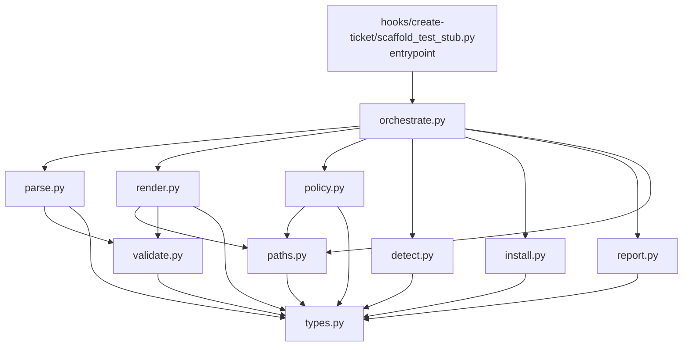

---
ticket_refs:
  - siege-analytics/claude-configs-public#687
  - siege-analytics/claude-configs-public#682
  - siege-analytics/claude-configs-public#683
  - siege-analytics/claude-configs-public#685
---

# Design: epic #682 python rewrite of the executable path

Task: produce the module layout, the contract types, the dependency and packaging decisions, the disposition of every checklist item and every live finding, and the cutover shape.
Ticket: #687 (part of epic #682, follows #683 and #685).
Fact Sheet: `plans/investigate-682-executable-path.md` (PR #684, branch `feat/683-investigate-executable-path`, at `7d50cce`).
Pre-mortem: `plans/pre-mortem-682-python-rewrite.md` (PR #686, branch `feat/687-python-design`, at `a9e8600`).

Step 0: `bash scripts/discipline/evaluate-ticket.sh 687` returns PASS. Sections Context, Goal, Acceptance present; falsifiable token present; `/think` link present; assumptions block present.

Pinning: every line citation below resolves against `develop` at the merge-base with `epic/682-python-executable-path`, which is the tree the rewrite replaces. Where a citation is to the fact sheet or the pre-mortem, the commit is named above. If the epic rebases, re-run the AC checkers before trusting a line number.

## Context

### What exists

Two shell surfaces, 24 live functions, both invoked by the ticket-creation hook:

- `hooks/create-ticket/scaffold-test-stub.sh` -- parses `Automation:` blocks out of a ticket body, resolves a template per tool and layer, substitutes placeholders, writes a test stub inside the repo root, invokes a probe per AC, and renders a footer.
- `scripts/probe/_common.sh` plus six per-tool wrappers -- detects whether a tool is installed, resolves `tool_install_policy` from `PROJECT.md`, optionally installs, re-checks, and files an infra ticket through `gh`.

The two communicate over a subprocess boundary carrying a JSON document on stdout and a status in the exit code.

### What works today that must keep working

The hook is invoked on ticket creation for whoever has it installed locally. Its observable contract is: a stub file appears at the path named by `Stub:`, a footer listing generated stubs and blockers is appended to the ticket body, and an infra ticket is filed when a tool is missing under a permissive policy. Nothing else in this repository consumes either surface.

### What prompted this change

55 live defects. The fact sheet found 28 new ones on top of 27 still live from the PR #668 and PR #672 hostile reviews. Four are P0. Both existing suites are green and were green while eight of the 28 were live, so green is not an acceptance signal on this surface (fact sheet, "Both suites are green" paragraph). Epic #682 registered hypothesis H1: that a majority of those defects are structural rather than incidental, and dissolve under a shared dataclass, a shared renderer and exception propagation rather than needing 55 individual fixes. This note tests H1. If H1 fails, the epic descopes to per-defect fixes in bash.

### Scope boundary

This note is a design. It changes no file under `hooks/`, `scripts/`, `templates/` or `skills/`. It does not re-rank any severity; PR #684 and PR #686 own that. It does not retire the shell scripts; that is step 8 of the epic sequencing.

### Ticket-vs-target reality check

The ticket's factual claims about the current state were re-verified against the tree the rewrite replaces rather than against a stale branch:

- "24 functions" -- the epic #682 checklist enumerates 9 + 6 + 6 + 3 = 24 rows. Counted from the epic body this session.
- "`probe_run` at `scripts/probe/_common.sh:145` has zero test coverage" -- verified. `scripts/probe/_test_probe_common.sh` is 182 lines with four scenarios, all of them the #676 `sed`-substitution regression; it calls `_probe_file_infra_ticket` directly and never `probe_run`. This was re-established by repro during the fact sheet's finding 10-1 correction.
- "one `allow` token authorises both a `pip install --user` and a `sudo tee /etc/apt/sources.list.d` chain" -- verified. `scripts/probe/k6.sh:16` builds the `sudo gpg` + `sudo tee` + `sudo apt-get install` chain; `scripts/probe/_common.sh:166` and `:179` `eval` it.
- "55 live findings" -- 20 from PR #668, 7 from PR #672, 28 new. The prior counts were corrected by fact-sheet finding 10-1 after four dispositions were established by repro; this note uses the corrected figures and inherits the correction rather than re-deriving it.

One claim in the ticket's Context does **not** hold as written and is corrected here rather than carried forward: the ticket says the fact sheet's preliminary read "classifies 15 of the 55". The preliminary read names 10 structural and 5 incidental, which is 15 classified, so the count is right, but two of those ten (F-N19 and F-N24) are reclassified as incidental below. The overturn moves against H1, and is flagged in the H1 section rather than absorbed silently.

### Blast radius

Counts are `grep -rn <entity>` across `*.sh`, `*.py` and `*.md`, excluding `plans/`. `_field` is counted word-bounded because the unbounded grep matches `_fields` and returns 161.

- `_field`: CRITICAL (9 call sites: `scaffold-test-stub.sh` parse path)
- `_substitute`: CRITICAL (13 call sites: the render path plus SKILL.md and CHANGELOG references)
- `probe_run`: CRITICAL (11 call sites: six wrappers plus SKILL.md and CHANGELOG)
- `_probe_file_infra_ticket`: CRITICAL (11 call sites: `_common.sh`, the probe test suite, SKILL.md)
- `_probe_emit_json`: CRITICAL (8 call sites: `_common.sh` status branches plus the wrappers)
- `_probe_check_bin`: CRITICAL (5 call sites: `_common.sh` detection and post-install re-check)
- `_probe_get_version`: HIGH (4 call sites)
- `_safe_value`: HIGH (3 call sites)
- `tool_install_policy`: CRITICAL (8 call sites: `CHANGELOG.md:11`, `scripts/probe/_common.sh:12,48`, `skills/tool-availability-probe/SKILL.md:23,80,85,86,87`)
- `_probe_resolve_policy`, `_normalize_tool`, `_is_known_tool`, `_template_for_tool`, `_parse_probe_json`: MEDIUM (2 call sites each -- definition plus single caller)

Every entity in the top group is CRITICAL, and the tier rule says a CRITICAL entity favours backward-compatible approaches over breaking changes. That rule is **declined for this design**, with a reason: the fan-out is entirely internal to the two files being replaced plus their own documentation. There is no external caller, no other repository, and no consumer outside `hooks/create-ticket/` and `scripts/probe/`. The `tool_install_policy` count is the one that reaches beyond the surface, and its live blast radius in this repository is zero because no `PROJECT.md` exists here (fact sheet F-N3's sibling; #672 P1-3 records the same absence). The backward-compatibility rule protects callers that this surface does not have.

### Sibling-grep gate

This is a fix design, so the symptom shapes were grepped for siblings before any proposal.

| Shape | Query | Sites |
|---|---|---|
| `eval` of a variable-held command | `eval "\$` in `*.sh` | 2: `scripts/probe/_common.sh:166`, `:179` -- both in `probe_run`, both the F-N18 / F-N14 / #668 P2-2 path |
| Exit status discarded at a call site | `\|\| true` or `2>/dev/null` in the surface | 13 within `scaffold-test-stub.sh` + `scripts/probe/*.sh` |
| Command substitution into a variable | `=\$(` in `scaffold-test-stub.sh` | 25 -- every one strips trailing newlines (F-N5, #672 P2-6) |
| Same discarded-exit shape, repo-wide | `=\$(.*\|\| true)` in `hooks/` + `scripts/` | 99 files |

The last row is the important one and it is why the design is scoped the way it is. The "assign a subshell's stdout to a variable and swallow its exit code" shape is not a defect of the executable path; it is the ambient idiom of this repository's 99 shell hooks. N is far past the writing-rules:7 hard gate of 3, so the fix must be designed at the class level. **It is designed at the class level for the executable path and not for the other 98 files.** The class-level fix here is C-2: the probe result crosses the boundary as a typed object returned from a function call, so there is no exit code to swallow. Applying that to the remaining hooks is a different epic and is not opened by this note. Recording the boundary matters because a reviewer who runs the same grep will find 99 sites and should know the scoping was a decision rather than an oversight.

A second sibling class, found by the same pass: `except Exception` appears 13 times across `hooks/`, `scripts/` and `bin/` Python. F-N12's silent degradation is one of them (`_parse_probe_json:224`). The rewrite adds Python modules to a repository that already has a bare-except habit, so the design must name the rule rather than assume it (see C-2's mechanism).

## Questions

Decisions not yet made when this note started, and their resolutions. Each was a genuine fork, not a rhetorical one.

1. **Is there a Python packaging story to hang modules off?** No. There is no `pyproject.toml`, no `setup.py`, no `tests/` directory and no `conftest.py`. Every Python file in the repository is a standalone script invoked as `python3 <absolute path>`. `hooks/lib/*.py` use hyphenated filenames (`extract-json.py`, `probe-runner.py`, `resolve-think-gate.py`) and are therefore not importable as modules at all. A multi-module design must supply its own import mechanism. Resolved in Proposal B.
2. **Does anything execute either suite?** No. `.github/workflows/` contains `build-and-publish.yml`, `pr-base-guard.yml` and `publish-consumption-tags.yml`; grepping all three for `test.sh`, `_test` or `pytest` returns nothing. Neither `hooks/_test/*.test.sh` nor `scripts/probe/_test_probe_common.sh` is run by CI. This is pre-mortem E-2 restated as a fact about the target tree, and it makes C-8's "the ported suite is a floor" a promise unless something runs the floor. Resolved in the Cutover section: a CI workflow is part of the cutover unit.
3. **Does `bin/build.py` need changing to deploy a package directory?** No. `bin/build.py:765-771` copies `hooks/` wholesale via `shutil.rmtree` followed by `shutil.copytree`, so a directory under `hooks/lib/` deploys without a build change. Verified by reading the function.
4. **Is the name `probe` free under `hooks/lib/`?** No. `hooks/lib/probe-runner.py` already exists, is 330 lines, and is an unrelated probe-*matrix* runner for data-shape assumptions from #284. Any module named `probe*` at that level collides in a reader's head even though it cannot collide as an import (the existing file is hyphenated and unimportable). Resolved by naming the package `exec_path`.
5. **How do C-2 and C-7 both hold?** Resolved in the Design; it is the first of the three decisions ticket #687 requires rather than defers.
6. **What happens to a `PROJECT.md` that says `allow`?** Resolved in the Design under the privilege vocabulary; it is the second required decision.
7. **Can the epic ship a Python hook that calls bash probes?** Resolved in Cutover; it is the third, and it is FM-13, the pre-mortem's only Elephant.

### Assumptions

- The fact sheet and the pre-mortem are the factual basis. This note dispositions findings; it does not re-derive them.
- Both artifacts are under hostile review (PR #684 round 3, PR #686 round 2). If either review adds or revises a finding, the affected disposition is restated and the H1 denominator moves with the finding count. H1 fails below by 6, which is wide enough that a single added or revised finding will not reverse it, but the denominator is still not final and the shortfall is what would move.
- `python3` is available wherever the git hook runs. The pre-mortem's FM-12 records this as unverified; C-12 makes the failure legible rather than removing the dependency.
- A constraint may be declined. A decline with a reason and a falsifier is a valid outcome; a constraint silently unaddressed is not.

## Proposals

Three module shapes were considered. The dimension that separates them is how a multi-module Python design gets imports in a repository with no packaging.

| | A: one file | B: package directory under `hooks/lib/` | C: zipapp built by `bin/build.py` |
|---|---|---|---|
| **What** | A single `scaffold_test_stub.py` containing every function | A directory `hooks/lib/exec_path/` of underscore-named modules, imported after a `sys.path` bootstrap in the entrypoint | The same modules, packed into a `.pyz` by the build step and executed as a single artifact |
| **How** | Port each shell function to a Python function in one file; the hook invokes the file | Entrypoint inserts the package's parent on `sys.path`, then `import exec_path.orchestrate`; `bin/build.py` needs no change because `hooks/` is copied wholesale | Add a packaging step to `bin/build.py`; the hook invokes the `.pyz` |
| **Tradeoffs** | Simplest deploy, zero import machinery; but every constraint that is about module boundaries becomes unenforceable | Real module boundaries that a test can assert on; costs one bootstrap stanza in the entrypoint and hyphen-to-underscore naming that diverges from the existing `hooks/lib/*.py` convention | Boundaries plus a single deployable artifact; costs a new build stage, a new failure mode at build time, and makes editing a hook require a rebuild |
| **Risk** | C-7 (detection has no import path to installer or issue-filer) is not merely unsatisfied, it is unstatable: in one file every function can call every other. The pre-mortem's FM-7 ships by construction | The bootstrap stanza is a foot-gun if it is copied into a second entrypoint and drifts; mitigated by having exactly one entrypoint | The build step becomes load-bearing for the hook to run at all, in a repository where `bin/build.py --deploy` is already a manual step people forget |

**Recommendation: B.** A is disqualified rather than merely worse: the epic's entire premise is that structural boundaries discharge defects, and A removes the boundaries. C buys one artifact at the price of making the hook undebuggable without a rebuild, on a surface whose defining problem is that its failures are invisible.

The naming divergence B introduces is worth stating plainly: `hooks/lib/exec_path/types.py` uses underscores while its neighbours `hooks/lib/extract-json.py` and `hooks/lib/resolve-think-gate.py` use hyphens. That is not a style inconsistency to be tidied later; it is the difference between a file that can be imported and one that cannot, and the hyphenated neighbours are scripts precisely because nothing imports them.

## Design

### Hypothesis H1: structural versus incidental

The discriminator, fixed before classifying:

- **Structural** -- the construct that carries the defect does not exist in the new design. Not "would be easier to avoid" and not "a test would catch it": the shape is unrepresentable or the operation is absent from the language and libraries chosen.
- **Incidental** -- the defect requires a bespoke fix that someone must decide to make, regardless of implementation language. Ordering errors, wrong data in a template, missing test coverage and documentation drift are incidental even when a discipline would prevent them, because a discipline is not a construct.

**This classification is made by the same author who registered H1, which is exactly the weakness PR #684 round 2 identified about the severity rubric (fact-sheet finding 9-3).** Two mitigations, both weaker than independence: the discriminator was written before the classification rather than after it, and every reclassification away from the fact sheet's preliminary read is listed below with its direction. The hostile reviewer on this note should re-classify a sample rather than audit the totals, because the totals are the thing an author under H1 pressure will get right.

**Count.** 22 of 55 structural, against a pre-registered threshold of 28. Round 1 of this note published 31; the correction is set out below. Produced by counting DISCHARGED-BY-CONSTRUCTION rows in the finding-disposition table below:

```
grep -cE '^\| (#6(68|72) P|F-N)[^|]*\|[^|]*\| DISCHARGED-BY-CONSTRUCTION' plans/think-682-python-design.md
```

**Verdict: DESCOPE.** H1 fails at 22/55 against a threshold of 28. The 31 published in round 1 of this note was wrong, and the correction is the note's main result.

**What moved, and how.** Round 1 of hostile review (HR692-3) contested five structural calls. All five are accepted. Re-deriving the whole table rather than the five rows named turned up four more in the same direction. Nine rows move from structural to incidental; none moves the other way.

| Row | Was | Now | Why it is not a construct |
|---|---|---|---|
| `#668 P0-5` | S | I | a per-run cache keyed by `Tool` is a data structure someone adds; nothing in Python makes a repeated call for one tool unrepresentable |
| `#668 P1-1` | S | I | `Version \| None` is an annotation, and no type checker is run (see below), so it forbids nothing at runtime |
| `#668 P1-4` | S | I | `paths.repo_root()` anchors resolution only for code that calls it; `Path.cwd()` and relative opens remain available. A convention, not a construct |
| `#668 P1-5` | S | I | `IssueRef \| None` is the same annotation-only claim, and the note already classified the identical argument for F-N14 as incidental. The two cannot both be right |
| `#668 P2-7` | S | I | library modules return values, but `sys.exit` in one still terminates the caller, and no falsifier forbids it |
| `#672 P2-1` | S | I | a ported fixture can use a raw string. Named as contestable in round 1 and now conceded |
| `F-N6` | S | I | the note's own wording is "a design commitment rather than a language guarantee", which is the definition of the incidental side |
| `F-N10` | S | I | consumer half of `#668 P0-5`, discharged by the same cache, so it moves for the same reason |
| `F-N27` | S | I | a required `layer` parameter forbids omitting the argument, not discarding the parsed value and passing a different one, which is the defect |

The ids in this table are backticked so that the AC3 parser, whose regex is quoted in the falsifiable-claims section, does not read these nine rows as nine more findings. An earlier draft of this table was not backticked and produced 64 rows for 55 findings. That is the same defect as PR #686's round-2 finding R2-S2-2 one artifact away: a published command whose selector matches a second table that was added after the command was written.

Four of the nine (#668 P1-1, P1-4, P1-5 and F-N6) were found by this note, not by the reviewer. They are recorded here because a correction that only ever lands where a reviewer pointed is a correction made under supervision rather than a re-derivation.

**The type-checker hole, which is upstream of three of those rows.** No type checker is mandated anywhere in the design: the Tooling and Cutover sections name no `mypy` or `pyright` step, and the only occurrences of either word in this note are this paragraph and the falsifiable claim that refers back to it (`grep -ncE 'mypy|pyright|--strict'` returns 2, both of them commentary rather than a mandated step). Several structural claims were built on annotations, and an annotation that nothing checks makes no shape unrepresentable. Adding `mypy --strict` to the cutover unit would convert #668 P1-1, #668 P1-5 and F-N14 into enforced constraints and would raise the count. **This note does not make that change,** because it was identified only after the count fell below the threshold, and adding an enforcement mechanism at that moment is exactly the move fact-sheet finding 9-3 warns about when the author of a hypothesis also scores it. It is filed as a proposal for whoever takes the descoped epic, to be decided by someone other than this author.

**Why the verdict is not 26.** The reviewer's stated rule is that a mechanism is structural only where the defect cannot be reintroduced. Applied to the five rows they chose, it yields 26. Applied evenly to five rows they accepted, it takes those too: `InstallPlan.argv` does not prevent `subprocess.run(" ".join(argv), shell=True)` (#668 P2-2); `json.dumps` does not prevent `'{"tool": "%s"}' % t` (#668 P1-2); "no awk" does not remove `awk` from `PATH` (F-N9); `sys.stdin.read()` not stripping does not prevent `.rstrip("\n")` (#672 P2-6); a `Layer` enum does not prevent `layer.value.upper()` (F-N16). Each was executed, not argued. In a language where nothing is unrepresentable, that rule drives the count to near zero, so 26 is not a measurement of anything and should not be carried forward as one. The verdict is DESCOPE because 22 is below 28 under the discriminator as this note published it, not because the reviewer's stricter rule was adopted.

**What DESCOPE commits the epic to.** Per the framing above, "if H1 fails, the epic descopes to per-defect fixes in bash". That is now the recommendation. The rest of this note does not evaporate with H1: the 16 constraints, their mechanisms and falsifiers, and the 24-row checklist describe defects and remedies that are true of the bash tree as well, and the C-6 privilege narrowing and the C-8 test floor are worth doing in either language. What does not survive is the claim that a rewrite is the economical way to get them.

**Reclassifications from the fact sheet's preliminary read.** These are a separate axis from the nine round-1 moves above: they are places where this note disagreed with the fact sheet when it first classified, not places where it later corrected itself. Two, both against H1:

- **F-N19** (the probe suite writes its own private copy of the infra-ticket template) -- preliminary read: structural. Here: **incidental**. C-5 is a test-authoring rule. A fixture library can offer "the shipped template read from disk" as its only template accessor, but nothing stops a test from opening a file itself. The discriminator says a discipline is not a construct.
- **F-N24** (no fixture library exists) -- preliminary read: structural. Here: **incidental**. Classifying "the artefact does not exist yet" as discharged-by-construction is a category error; it is fixed by building it, which is the definition of a fix someone must decide to make.

No reclassification runs in the H1-favourable direction. Three were considered and rejected in order to keep it that way: F-N1 (a `ValidatedPath` newtype would make the pre-containment `mkdir` unrepresentable, but nothing prevents an `os.makedirs` call before validation, so it stays incidental as the preliminary read had it); F-N14 (an `InstallPlan | None` return makes the `unsupported-os:` prose sentinel unrepresentable, which is a strong structural argument, but the preliminary read called it incidental and overturning it moves the count to 23 in the direction that flatters the hypothesis, so it stays incidental); and F-N26 (per-sink validators make "one regex guarding three grammars" unrepresentable, same argument, same decision). **If the hostile reviewer accepts any of these three, the shortfall narrows; the note declines to claim them.** Before round 1 this sentence read "the margin widens", which was true when the count was 31 and the verdict CONTINUE. It is one of five downstream restatements the round-1 remediation left on the old number, listed in the self-review.

### Module layout

Package: `hooks/lib/exec_path/`. Entrypoint: `hooks/create-ticket/scaffold_test_stub.py`.



Arrows are imports. The graph is acyclic and `types.py` is a sink: it imports nothing in-package.

Public surface, one entry per node in the diagram:

| Module | Public surface |
|---|---|
| `types.py` | `Tool` (enum), `Layer` (enum), `PrivilegeTier` (enum), `InstallPolicy` (enum), `ProbeStatus` (enum), `Version` (dataclass), `ToolSpec` (dataclass), `InstallPlan` (dataclass), `ProbeResult` (dataclass, with `to_json` / `from_json`), `AutomationBlock` (dataclass), `Sink` (enum) |
| `paths.py` | `repo_root() -> Path`, `resolve_within_repo(candidate: str, root: Path) -> Path` (raises `PathEscapesRepo`), `PathEscapesRepo` |
| `validate.py` | `validate_for(sink: Sink, value: str) -> str` (raises `SinkValidationError`), `SINK_VALIDATORS: dict[Sink, Callable]`, `SinkValidationError` |
| `parse.py` | `parse_automation_blocks(body: str) -> list[AutomationBlock]` (raises `MalformedAutomationBlock`), `MalformedAutomationBlock` |
| `detect.py` | `detect(spec: ToolSpec) -> Version \| None`, `DETECTORS: dict[Tool, Callable[[], Version \| None]]` |
| `install.py` | `plan_for(tool: Tool, host: HostFacts) -> InstallPlan \| None`, `HostFacts`, `run_plan(plan: InstallPlan, runner: Runner) -> None` (raises `InstallFailed`), `Runner` (protocol), `SubprocessRunner`, `InstallFailed` |
| `policy.py` | `resolve_policy(root: Path) -> InstallPolicy`, `authorise(policy: InstallPolicy, confirmed: PrivilegeTier \| None) -> Authorisation`, `InvalidPolicyValue` |
| `render.py` | `template_for(tool: Tool, layer: Layer) -> Path`, `render(template: Path, values: dict[str, str]) -> str`, `placeholders(template: Path) -> set[str]`, `TemplateMissing`, `PlaceholderMismatch` |
| `report.py` | `IssueFiler` (protocol), `GhIssueFiler`, `RecordingIssueFiler`, `file_infra_ticket(filer: IssueFiler, result: ProbeResult, body: str) -> IssueRef` |
| `orchestrate.py` | `probe(tool: Tool, layer: Layer, ctx: RunContext) -> ProbeResult`, `scaffold(body: str, ctx: RunContext) -> ScaffoldOutcome`, `RunContext`, `ScaffoldOutcome` |
| entrypoint | `main(argv) -> int`. Python-version check, `sys.path` bootstrap, construction of the real `RunContext` (the only place `GhIssueFiler` and `SubprocessRunner` are instantiated) |

The bootstrap stanza, stated once because it is the load-bearing part of Proposal B:

```python
import sys
from pathlib import Path
sys.path.insert(0, str(Path(__file__).resolve().parent.parent / "lib"))
```

It appears in exactly one file. A test asserts that: `grep -rl 'sys.path.insert' hooks/ | wc -l` returns 1.

#### Resolving C-2 against C-7

The two constraints are said to pull in opposite directions. They do not, and the appearance that they do rests on an unexamined assumption: that "the probe" is one module.

C-2 requires the probe result to cross module boundaries as a typed object returned from a function call, which requires the hook to import the probe. C-7 requires the detection module to have no transitive import path to the installer or the issue-filer. Both hold once the probe is factored into `detect`, `install`, `report` and `orchestrate`:

- The entrypoint imports `orchestrate` and calls `orchestrate.probe(...)`, which returns a `ProbeResult`. No subprocess boundary, no exit code, no JSON. **C-2 satisfied.**
- `detect.py` imports `types` and nothing else. The arrow runs `orchestrate -> detect`, never the reverse, so detection has no path -- transitive or otherwise -- to `install` or `report`. **C-7 satisfied.**

The mechanism that keeps C-7 true as the code changes is not the diagram; it is a test that imports `detect` in a fresh subprocess interpreter and asserts `exec_path.install` and `exec_path.report` are absent from `sys.modules`:

```
python3 -c "import sys; sys.path.insert(0,'hooks/lib'); import exec_path.detect; \
assert 'exec_path.install' not in sys.modules and 'exec_path.report' not in sys.modules"
```

Fresh interpreter matters. Run inside a process that has already imported `orchestrate`, the assertion passes vacuously because the modules are in `sys.modules` for a different reason. The named test is `test_detect_has_no_installer_import_path` and it shells out.

### Contract types

| Type | Defined in | May be imported by | Notes |
|---|---|---|---|
| `Tool` | `types.py` | everything | Enum with six members. Replaces `_normalize_tool` and `_is_known_tool`: an unknown tool name is a `ValueError` from `Tool(...)`, not a boolean check against a hand-maintained list. Discharges F-N4. |
| `Layer` | `types.py` | everything | Enum with one canonical spelling per layer. C-16. Discharges F-N16. |
| `PrivilegeTier` | `types.py` | everything | `USER < SYSTEM < ROOT`, ordered. C-6. |
| `InstallPolicy` | `types.py` | everything | `BLOCK`, `PROMPT`, `ALLOW`, `ALLOW_PRIVILEGED`. Parsed from `PROJECT.md` (`block`, `prompt`, `allow`, `allow-privileged`); an unrecognised value raises `InvalidPolicyValue` rather than falling through to block. Discharges #668 P1-6. |
| `Authorisation` | `types.py` | everything | `NoInstall()` or `UpTo(tier: PrivilegeTier)`. The result of `policy.authorise`. `BLOCK` maps to `NoInstall`, which is a distinct value rather than a bottom tier, because `PrivilegeTier` is ordered and has no member below `USER`. C-6. |
| `ProbeStatus` | `types.py` | everything | The status vocabulary the JSON contract used to carry as a string literal. C-4: no literal status string appears outside `types.py`. |
| `ToolSpec` | `types.py` | everything | `tool`, `canonical_name`, `binary_name`, `module_name`, `version_argv`. `canonical_name` and `binary_name` are separate fields; conflating them is F-N17. |
| `InstallPlan` | `types.py` | everything | `argv: list[list[str]]`, `tier: PrivilegeTier`, `tool: Tool`. An argument list, never a string. There is no `eval`, and no shell, so there is no slot in which prose can be executed. C-6. |
| `ProbeResult` | `types.py` | everything | The single definition of the probe contract. `to_json` / `from_json` are methods on it. C-4: no contract key name appears as a literal anywhere else. |
| `AutomationBlock` | `types.py` | everything | `tool`, `layer`, `stub_path`, `feature`, `ac_id`, and the raw source span. Every field is consumed or listed in the C-16 exclusion list. |
| `Sink` | `types.py` | everything | `FILESYSTEM_PATH`, `TEMPLATE_PLACEHOLDER`, `SUBPROCESS_ARG`, `PYTHON_IDENTIFIER`, `JSON_FIELD`, `ISSUE_BODY`. C-15. |

`ProbeResult` retains `to_json` / `from_json` even though the in-process design does not need them, for one reason: `skills/tool-availability-probe/SKILL.md` documents a JSON contract that consumers outside this repository may rely on, and the wrappers remain invocable as scripts for that audience. The methods exist to keep the documented external contract; the internal path does not use them. This is stated because an implementer will otherwise delete them as dead code and break the documented surface.

### Constraint dispositions

#### C-1

- **Constraint:** Path resolution and containment validation happen in one side-effect-free function that returns a validated path or raises. No filesystem mutation may appear before it in any caller.
- **Disposition:** SATISFIED
- **Mechanism:** `paths.resolve_within_repo` is the only function that turns a `Stub:` value into a `Path`. It calls `Path.resolve()` and `Path.is_relative_to(root)` and raises `PathEscapesRepo`. It performs no `mkdir`. `orchestrate.scaffold` calls it before any write, and the write helper's signature takes the returned `Path`.
- **Falsifier:** `grep -n 'makedirs\|mkdir' hooks/lib/exec_path/*.py` returns sites only in modules that import `paths`, and a named test `test_traversal_creates_no_directory` runs the hook against `Stub: ../../ESCAPED_DIR/t.py` with a fresh temporary parent that does **not** pre-create the target, then asserts the target's parent does not exist. If the assertion can pass while `ESCAPED_DIR` exists, the falsifier is broken, which is the F-N22 defect and the reason the fixture is rewritten rather than extended.

#### C-2

- **Constraint:** The probe result crosses module boundaries as a typed object returned from a function call. Where a subprocess boundary is unavoidable, a non-zero exit raises a named exception; no call site may reach a default-valued result by ignoring a status.
- **Disposition:** SATISFIED
- **Mechanism:** `orchestrate.probe` returns a `ProbeResult`. The only subprocess boundaries left are `detect`'s version invocation and `install.run_plan`'s command execution, both through a `Runner` whose non-zero path raises (`InstallFailed`) rather than returning a sentinel. `ProbeResult` has no default constructor: every field is required, so there is no "empty result" a caller can fall into. `except Exception` is forbidden in the package; the repository already has 13 instances of it and F-N12 is one of them, so the rule is enforced rather than assumed.
- **Falsifier:** `grep -rn 'except Exception\|except:' hooks/lib/exec_path/` returns 0. `grep -rn 'ProbeResult(' hooks/lib/exec_path/` shows no call with fewer than the full field set. A named test `test_probe_failure_raises_not_defaults` makes the version invocation fail and asserts an exception rather than a `ProbeResult` with an empty status.

#### C-3

- **Constraint:** Tool detection is a per-tool callable returning a version or `None`. There is no configurable binary-name string, so the `__playwright_absent__` shim is unrepresentable.
- **Disposition:** SATISFIED
- **Mechanism:** `detect.DETECTORS` maps `Tool` to a zero-argument callable. `ToolSpec.binary_name` is a constant in `types.py`, not a parameter threaded through `probe_run`. There is no code path that constructs a binary name from a string that a caller supplies.
- **Falsifier:** `grep -rn '_absent__' hooks/ scripts/ templates/` returns 0 after cutover. `DETECTORS` has exactly six keys and `set(DETECTORS) == set(Tool)` is asserted by `test_every_tool_has_a_detector`.

#### C-4

- **Constraint:** One dataclass defines the probe result. Serialisation and deserialisation are methods on it. No literal contract key name appears outside that module.
- **Disposition:** SATISFIED
- **Mechanism:** `ProbeResult` in `types.py`, with `to_json` and `from_json`. Status values are `ProbeStatus` members, not strings.
- **Falsifier:** For each contract key (`status`, `tool`, `version`, `ticket`, `layer`), `grep -rn '"<key>"' hooks/lib/exec_path/` returns matches only in `types.py`. A named test `test_no_contract_literal_outside_types` performs that grep and fails on any hit elsewhere.

#### C-5

- **Constraint:** Rendering tests read shipped templates from disk. No test contains a copy of a template. A placeholder-set equality test asserts renderer and template agree in both directions.
- **Disposition:** SATISFIED
- **Mechanism:** The fixture library exposes `shipped_template(tool, layer) -> Path` resolved through `render.template_for`, and no other template accessor. `render.placeholders(template)` returns the set found in the file; `test_placeholder_sets_agree` asserts it equals the set the renderer supplies, in both directions, for every shipped template.
- **Falsifier:** The two-directional assertion. A renderer that supplies a placeholder the template lacks fails one direction; a template with a placeholder the renderer never supplies fails the other. F-N17 is the second direction and F-N5 is caught by a separate byte-exactness assertion in the same suite.

#### C-6

- **Constraint:** Install commands are argument lists with a declared privilege tier. The `allow` token authorises user-space installs only; privileged installs require a token that names privilege.
- **Disposition:** SATISFIED
- **Mechanism:** `InstallPlan.argv` is `list[list[str]]` and `InstallPlan.tier` is a `PrivilegeTier`. `policy.authorise` returns an `Authorisation`, which is either `NoInstall` or `UpTo(tier)`. A plan is executed only when the authorisation is `UpTo(t)` and `plan.tier <= t`; otherwise the run yields `ProbeStatus.BLOCKED_ON_INFRA` and files an infra ticket naming both the required tier and the token that would authorise it. No string is ever passed to a shell. The vocabulary decision in full:

  | `PROJECT.md` value | `InstallPolicy` | `authorise(...)` | Effect on today's k6 path |
  |---|---|---|---|
  | `block` | `BLOCK` | `NoInstall` | unchanged: no install |
  | `allow` | `ALLOW` | `UpTo(USER)` | **behaviour change**: the `sudo` chain is refused and an infra ticket is filed instead of executing |
  | `prompt` | `PROMPT` | `UpTo(confirmed)`, or `NoInstall` when `confirmed is None` | unchanged in shape; the prompt now names the tier |
  | `allow-privileged` | `ALLOW_PRIVILEGED` | `UpTo(ROOT)` | the only value under which the `sudo` chain runs |

  Round 1 of hostile review (HR692-1) found the earlier form of this paragraph undeliverable: it introduced `allow-privileged` in prose while the `InstallPolicy` enum listed only three members, and it gave `max_tier` a return type of `PrivilegeTier`, which has no member meaning "no install" because the tier ordering starts at `USER`. An implementer following the published surface had to invent a state the design had not specified. `Authorisation` is that state, named. The `PROMPT`-with-no-confirmation case was undefined in the same paragraph and is now `NoInstall`: declining a prompt authorises nothing, which is the only reading under which a non-interactive run cannot silently acquire the confirmed tier.

  An existing `PROJECT.md` that says `allow` therefore stops installing k6 and starts filing a ticket. That is a breaking change to a documented value and needs a CHANGELOG entry under `[Unreleased]` plus the `skills/tool-availability-probe/SKILL.md` policy table. Its live blast radius in this repository is zero: no `PROJECT.md` exists here (#672 P1-3). It is not zero for consumers, which is why it is a CHANGELOG entry and not a silent narrowing.
- **Falsifier:** `test_allow_never_runs_privileged` drives an install under `allow` with a `RecordingRunner` and asserts no recorded argv contains `sudo`. This is one of the six C-8 floor tests and it fails against the bash implementation, where `scripts/probe/_common.sh:166` `eval`s `k6.sh:16`'s chain under exactly that policy.

#### C-7

- **Constraint:** Detection and remediation are separate modules. The detection module has no transitive import path to the installer or to the issue-filer.
- **Disposition:** SATISFIED
- **Mechanism:** `detect.py` imports `types` only. The dependency direction is `orchestrate -> detect`, never the reverse. See "Resolving C-2 against C-7" above for why this does not conflict with C-2.
- **Falsifier:** `test_detect_has_no_installer_import_path` parses every module in `exec_path/` with `ast`, collects every `Import` and `ImportFrom` node reached by `ast.walk` (so a `from . import install` nested inside a function body counts exactly as much as one at module scope), computes the transitive closure from `exec_path.detect`, and fails if `exec_path.install` or `exec_path.report` is in it. It fails a second way if any module in the package calls `importlib.import_module` or `__import__`, because a dynamic import makes the static graph non-authoritative and the constraint unverifiable rather than satisfied.

  A supplemental smoke test spawns a fresh `python3 -c`, imports `exec_path.detect`, and asserts the two modules are absent from `sys.modules`. It is retained but it is not the falsifier, because round 1 of hostile review (HR692-2) showed it passing against a package that violates C-7. The gap is specific and worth stating precisely rather than in the reviewer's broader terms: the `sys.modules` test does catch an eager transitive path, because `detect -> helper -> install` puts `install` in `sys.modules` at import time. What it does not catch is a **lazy** import, `def remediate_later(): from . import install`, which leaves `sys.modules` clean at import and still constitutes an import path. Both shapes were run against both checks before this paragraph was written; the static check fails on the lazy case, the eager transitive case and the dynamic case, and passes on the compliant package.

#### C-8

- **Constraint:** The ported suite is a floor. At least six tests must fail against the bash implementation at `epic/682-python-executable-path` and pass against the rewrite.
- **Disposition:** SATISFIED
- **Mechanism:** Six named tests, one per required mode:

  | Test | Mode | Fails against bash because |
  |---|---|---|
  | `test_traversal_creates_no_directory` | F-N1 | `mkdir -p` at `scaffold-test-stub.sh:329` precedes the containment check; the fixture must not pre-create the target |
  | `test_probe_exit_status_reaches_caller` | F-N11 | `2>/dev/null \|\| true` at `:286` discards exit 2 and 78 |
  | `test_successful_install_reports_installed` | F-N13 | the `__playwright_absent__` shim makes the post-install re-check unsatisfiable |
  | `test_allow_never_runs_privileged` | F-N18 | one `allow` token authorises the `sudo` chain |
  | `test_unsupported_os_is_not_executed` | F-N14 | the `unsupported-os:` prose string reaches `eval` |
  | `test_traversal_fixture_target_not_precreated` | F-N22 | `mktemp -d` at `hooks/_test/scaffold_test_stub.test.sh:283` pre-creates the escape target, so the existing fixture cannot fail |

  The sixth is a separate test from the first for a reason: F-N22 is a defect in the *fixture*, and a test that only asserts the hook's behaviour cannot detect it. `test_traversal_fixture_target_not_precreated` asserts a property of the fixture's own setup.
- **Falsifier:** Run the new suite against the bash tree and against the rewrite. Fewer than six in the fail-then-pass set means C-8 is unmet, which is a pre-registered kill criterion. `test_happy_path` is expected to change because F-N5 makes correct behaviour observably different (a trailing newline appears); each change is justified in the implementation PR body.

#### C-9

- **Constraint:** The probe/hook contract is exercised against a real probe object and a faked tool environment. Mocking is permitted below the subprocess boundary only. `probe_run`'s successor is covered before any wrapper is ported.
- **Disposition:** SATISFIED
- **Mechanism:** Tests call `orchestrate.probe` with a `RunContext` whose `Runner` and `IssueFiler` are recording fakes. `detect` is not mocked; the tool environment is faked by manipulating `PATH` in a temporary directory. Sequencing: `orchestrate.probe` and its tests land before any per-tool `ToolSpec` is added beyond the first.
- **Falsifier:** `grep -rn 'monkeypatch.setattr.*orchestrate\|mock.*ProbeResult' tests/executable_path/` returns 0 -- no test substitutes the object under test. Coverage of `orchestrate.probe`'s branches is asserted by a test per `InstallPolicy` value crossed with tool-present and tool-absent, which is the six status/exit combinations #668 P2-3 asked for.

#### C-10

- **Constraint:** All 24 epic checklist items carry a PORT / REDESIGN / CREATE disposition in the design note, and CREATE items are sequenced first.
- **Disposition:** SATISFIED
- **Mechanism:** The Checklist dispositions table below. Exactly one item is CREATE (the fixture library) and the Cutover section sequences it first.
- **Falsifier:** The table has 24 rows; every row's disposition is one of the three tokens and every row names a non-empty target module. The AC2 checker enumerates the 24 names from the epic body and asserts each appears.

#### C-11

- **Constraint:** Every live finding from PR #668 and PR #672 and every `F-N` finding carries a disposition of DISCHARGED-BY-CONSTRUCTION, FIXED-EXPLICITLY, or DECLINED-WITH-REASON.
- **Disposition:** SATISFIED
- **Mechanism:** The Finding dispositions table below, 55 rows.
- **Falsifier:** Row count is 55; the row set equals the union of the 20 live #668 IDs, the 7 live #672 IDs and the 28 `F-N` IDs, checked as set equality rather than by count. Count equality is what fact-sheet finding 10-1 showed is insufficient.

#### C-12

- **Constraint:** The entrypoint checks the Python version and fails with a message naming the interpreter and the required version.
- **Disposition:** SATISFIED
- **Mechanism:** The first executable statement of `hooks/create-ticket/scaffold_test_stub.py`, before the `sys.path` bootstrap and before any `from` import of package code, compares `sys.version_info` against the floor and on failure prints `sys.executable`, the found version and the required version to stderr and exits non-zero. The floor is **3.10**, chosen because `X | None` union syntax appears in the public surface above and `match` is likely in the parser; CI pins 3.12 via `actions/setup-python@v5`, so the floor is below what CI runs and the gap is the risk C-12 makes legible rather than removes.
- **Falsifier:** The check must precede the imports it protects, or it never runs. `head -20 hooks/create-ticket/scaffold_test_stub.py` shows the version check above every `from exec_path` line. A named test `test_version_gate_precedes_imports` runs the entrypoint under a stub interpreter reporting 3.9 and asserts the stderr message names the interpreter path, and that the message is not an ImportError or a SyntaxError.

#### C-13

- **Constraint:** The design names the cutover unit and states whether a partial merge is permitted; if it is, the interim cross-language contract is a schema file both sides read.
- **Disposition:** SATISFIED
- **Mechanism:** The Cutover section. Partial merge is not permitted, so no interim cross-language contract is required.
- **Falsifier:** `grep -c 'partial merge is not permitted' plans/think-682-python-design.md` returns at least 1, and the guard test named in Cutover fails if any package module references `scripts/probe/`.

#### C-14

- **Constraint:** The issue-filer is injected. The test default is a recording fake, and reaching the real `gh` requires a concrete implementation no test constructs.
- **Disposition:** SATISFIED
- **Mechanism:** `report.IssueFiler` is a protocol. `RecordingIssueFiler` lives in `report.py` and is the fixture library's default. `GhIssueFiler` is constructed in exactly one place: the entrypoint's `main`.
- **Falsifier:** `grep -rn 'GhIssueFiler(' hooks/ tests/` returns exactly one site, in the entrypoint. A named test `test_gh_filer_never_constructed_in_tests` performs that grep. A fake that is merely the *default* is not sufficient -- the grep is what makes the real filer unreachable, because a default can be overridden by a test that means well.

#### C-15

- **Constraint:** Validation is per-sink, and per-sink coverage is total. (a) No validator is shared between destinations with different legal alphabets; a value that becomes a Python identifier is checked with `str.isidentifier()` at that sink, independently of any shell-safety check. (b) Every value that reaches a sink passes a validator declared for that sink.
- **Disposition:** SATISFIED
- **Mechanism:** `Sink` enumerates the six destinations. `validate.SINK_VALIDATORS` maps each to a validator; `PYTHON_IDENTIFIER` is `str.isidentifier()`, `FILESYSTEM_PATH` is `paths.resolve_within_repo`, `SUBPROCESS_ARG` is a no-op with a comment saying why (argv lists need no quoting, and a no-op with a reason is a declared validator; an undeclared sink is not). `validate_for` raises on an unknown sink rather than passing the value through.
- **Falsifier:** Clause (a): `test_identifier_sink_rejects_hyphen` feeds `Feature: has-hyphen` and asserts rejection at the `PYTHON_IDENTIFIER` sink -- this is F-N26, and it fails today because one shell-safe regex guards all three grammars. Clause (b) is the harder one and needs its own check: `test_every_parsed_value_maps_to_a_sink` enumerates `AutomationBlock`'s fields, enumerates the sinks each reaches, and fails on any (field, sink) pair with no declared validator. The absent validator, not the wrong one, is what clause (b) exists to catch, and a test that only checks declared pairs would pass vacuously; the enumeration must start from the dataclass fields.

#### C-16

- **Constraint:** Every field the parser produces either reaches a consumer or appears in a documented exclusion list with a reason. The layer is an enum with one canonical spelling, defined alongside the probe result dataclass.
- **Disposition:** SATISFIED
- **Mechanism:** `Layer` is an enum in `types.py` alongside `ProbeResult`. `orchestrate.probe` takes `layer` as a parameter and puts it on the `ProbeResult`, so the value the hook parsed is the value the infra ticket carries -- that is F-N27, which today discards it. `types.py` carries a module-level `EXCLUDED_FIELDS: dict[str, str]` mapping field name to reason, and it is the documented exclusion list.
- **Falsifier:** `test_every_parsed_field_reaches_a_consumer` walks `AutomationBlock`'s fields and asserts each is either read somewhere in the package or present in `EXCLUDED_FIELDS`. `test_layer_round_trips` asserts the `Layer` on a filed infra ticket equals the `Layer` parsed from the block, which fails against bash because the wrapper's hard-coded layer is what gets filed.

### Checklist dispositions

All 24 items from the epic #682 functions checklist.

| # | Checklist item | Disposition | Target module |
|---|---|---|---|
| 1 | `_field` -- extract field from Automation block | REDESIGN | `parse.py` |
| 2 | `_safe_value` -- regex allowlist for substitution values | REDESIGN | `validate.py` |
| 3 | `_substitute` -- placeholder substitution | REDESIGN | `render.py` |
| 4 | `_normalize_tool` -- underscore to dash normalization | REDESIGN | `types.py` (`Tool` enum parse) |
| 5 | `_is_known_tool` -- allowlist check | REDESIGN | `types.py` (`Tool` enum membership) |
| 6 | `_template_for_tool` -- layer+tool to template path | REDESIGN | `render.py` |
| 7 | `_parse_probe_json` -- probe stdout parse | REDESIGN | `types.py` (`ProbeResult.from_json`; the internal path stops parsing JSON entirely) |
| 8 | awk block splitter | REDESIGN | `parse.py` |
| 9 | main loop -- orchestration, containment, atomic write, footer | REDESIGN | `orchestrate.py` with `paths.py` |
| 10 | `_probe_emit_json` -- JSON output emitter | REDESIGN | `types.py` (`ProbeResult.to_json`) |
| 11 | `_probe_resolve_policy` -- `PROJECT.md` extractor | REDESIGN | `policy.py` |
| 12 | `_probe_check_bin` -- presence check | REDESIGN | `detect.py` |
| 13 | `_probe_get_version` -- version fetch | REDESIGN | `detect.py` |
| 14 | `_probe_file_infra_ticket` -- render + `gh` file | REDESIGN | `report.py` with `render.py` |
| 15 | `probe_run` -- orchestration, policy branching, re-check | REDESIGN | `orchestrate.py` |
| 16 | `pytest.sh` | PORT | `detect.py` + `install.py` (`ToolSpec`) |
| 17 | `playwright.sh` | REDESIGN | `detect.py` + `install.py` (carries the F-N13 shim) |
| 18 | `vitest.sh` | REDESIGN | `detect.py` + `install.py` (carries the F-N13 shim) |
| 19 | `schemathesis.sh` | PORT | `detect.py` + `install.py` (`ToolSpec`) |
| 20 | `great-expectations.sh` | REDESIGN | `detect.py` + `install.py` (canonical name differs from binary name, F-N17) |
| 21 | `k6.sh` | REDESIGN | `detect.py` + `install.py` (privilege tier, unsupported-OS, F-N18 and F-N14) |
| 22 | `scripts/probe/_test_probe_common.sh` -- port to pytest | REDESIGN | `tests/executable_path/test_probe.py` |
| 23 | `hooks/_test/scaffold_test_stub.test.sh` -- port to pytest | REDESIGN | `tests/executable_path/test_scaffold.py` |
| 24 | Fixture library -- test doubles for `gh`, `PROJECT.md`, templates, tool states | CREATE | `tests/executable_path/fixtures.py` |

Two items say PORT rather than REDESIGN, and the distinction is load-bearing: `pytest.sh` and `schemathesis.sh` contain no defect of their own. Their content becomes two `ToolSpec` literals. Every other wrapper carries a finding and is redesigned rather than transcribed. The disposition split is 21 REDESIGN, 2 PORT, 1 CREATE, from `grep -oE '^\| [0-9]+ \| .+ \| (PORT\|REDESIGN\|CREATE) \|' | awk -F'\|' '{print $4}' | sort | uniq -c`. The 21 REDESIGN rows are the concrete form of the pre-mortem's FM-1: a faithful port is the failure, not the goal.

`tests/executable_path/` is the path the epic's own falsifiable-by names (`pytest tests/executable_path/` returns 0). The directory does not exist and neither does a pytest configuration, so the CREATE item at row 24 brings `tests/executable_path/__init__.py`, `conftest.py` and a `pytest.ini` (or `[tool.pytest.ini_options]` in a new `pyproject.toml`) with it.

### Finding dispositions

All 55 live findings. `S` marks the H1 classification: `S` structural, `I` incidental. DISCHARGED-BY-CONSTRUCTION rows are exactly the `S` rows.

**The discriminator is binary and has no cell for a finding that partly dissolves, so every mixed row rounds to `I`.** That rounding is directional: it can only lower the count, never raise it, so the published 22 is a floor rather than a point estimate. `#668 P1-7` at `:463` is the clearest instance -- its own mechanism text reads "the `sed` half dissolves; the `gh` title half still needs a declared validator" -- and it is recorded as `I`.

Seven `I` rows concede a structural component in their own mechanism text: `#668 P1-7`, `#668 P2-6` (`:469`), F-N1 (`:480`), F-N14 (`:494`), F-N17 (`:497`), F-N19 (`:499`) and F-N26 (`:506`). Rounding those the other way gives 29 against a threshold of 28. Removing any single one of the seven still gives 28. **The verdict is therefore not stable under the alternative reading of this table's own tie-break rule.** DESCOPE rests on the rounding rule being the correct rule, not on a margin, and the rounding rule is asserted here rather than independently evidenced. It is the thing to attack.

A second and worse dependency runs through `#668 P1-1` at `:457`. It is classified `I` on the stated ground that "the annotation is unchecked, so it forbids nothing". Under `mypy --strict` the annotation is checked and does forbid something, so that row's classification is a consequence of this note's own decision at `:157` to mandate no type checker rather than an independent judgement about the design. The tooling decision partly determines the incidental count, and the incidental count is the verdict. That loop was undeclared before this revision.

| ID | H1 | Disposition | Mechanism or reason |
|---|---|---|---|
| #668 P0-2 | S | DISCHARGED-BY-CONSTRUCTION | `gh` failure raises through `report.file_infra_ticket`; there is no unchecked command substitution to swallow it (C-2, C-14) |
| #668 P0-3 | S | DISCHARGED-BY-CONSTRUCTION | no configurable binary-name string, so the shim that makes the re-check unsatisfiable is unrepresentable (C-3) |
| #668 P0-4 | I | FIXED-EXPLICITLY | `policy.resolve_policy` implements the grammar SKILL.md documents; a doc-conformance test reads the SKILL.md example and parses it |
| #668 P0-5 | I | FIXED-EXPLICITLY | `orchestrate` holds a per-run cache keyed by `Tool`; N ACs naming one tool are one call, not N processes. **Reclassified in round 1 (HR692-3):** the cache is a data structure someone adds, not a construct |
| #668 P1-1 | I | FIXED-EXPLICITLY | per-tool detector returns `Version \| None`; module-present and binary-absent are distinct code paths in one callable (C-3). **Reclassified in round 1 (author-found):** the annotation is unchecked, so it forbids nothing |
| #668 P1-2 | S | DISCHARGED-BY-CONSTRUCTION | `ProbeResult.to_json` uses `json.dumps`; no hand-built JSON exists (C-4) |
| #668 P1-3 | I | FIXED-EXPLICITLY | `SubprocessRunner` passes a `timeout` to `subprocess.run`; an argv list does not imply a time-box, so this is a decision someone must make |
| #668 P1-4 | I | FIXED-EXPLICITLY | `paths.repo_root()` anchors policy and template resolution; nothing reads from the caller's CWD (C-1). **Reclassified in round 1 (author-found):** it anchors only code that calls it, so it is a convention |
| #668 P1-5 | I | FIXED-EXPLICITLY | `IssueRef \| None` replaces the `unfilable-gh-missing` string. **Reclassified in round 1 (author-found):** identical in form to F-N14, which this note already called incidental; the two cannot both stand |
| #668 P1-6 | S | DISCHARGED-BY-CONSTRUCTION | `InstallPolicy(...)` raises `InvalidPolicyValue`; there is no fall-through branch to degrade into |
| #668 P1-7 | I | FIXED-EXPLICITLY | the `sed` half dissolves; the `gh` title half still needs a declared validator at the `ISSUE_BODY` sink, which is a fix rather than a construct (C-15) |
| #668 P2-1 | S | DISCHARGED-BY-CONSTRUCTION | policy is parsed, not `sed`-extracted; `str.strip()` handles CR and byte-exact matching does not occur |
| #668 P2-2 | S | DISCHARGED-BY-CONSTRUCTION | `InstallPlan.argv` is a list and there is no `eval` and no shell, so prose in a command slot cannot execute (C-6) |
| #668 P2-3 | I | FIXED-EXPLICITLY | the ported suite plus the fixture library; six status/exit combinations are covered by the C-9 matrix |
| #668 P2-4 | I | FIXED-EXPLICITLY | substitute `basename(session_dir)` at the `ISSUE_BODY` sink; a leaked absolute path is a data choice, not a construct |
| #668 P2-5 | S | DISCHARGED-BY-CONSTRUCTION | `shutil.which` resolves against `PATH` and does not consult shell functions or builtins |
| #668 P2-6 | I | FIXED-EXPLICITLY | the title renderer must handle an absent blocker; `Optional` typing flags it but does not decide the wording |
| #668 P2-7 | I | FIXED-EXPLICITLY | library modules return values rather than exiting. **Reclassified in round 1 (HR692-3):** `sys.exit` in a library module still terminates the caller and no falsifier forbids it |
| #668 P2-8 | I | FIXED-EXPLICITLY | document the inherited proxy and index environment in SKILL.md; surface captured install output in the infra-ticket body instead of discarding it |
| #668 P2-9 | I | DECLINED-WITH-REASON | a waiver defect in `plans/self-review-662.md`, not a code defect. Declined here because a design note cannot withdraw a waiver; the withdrawal belongs on the #662 artifact. Counted in the denominator anyway, because a silent exclusion is the exact operation that produced fact-sheet finding 10-1. Excluding it gives 22 of 54 structural against a threshold of 27, so H1's verdict does not turn on it -- which before round 1 meant it still passed and now means it still fails |
| #672 P1-2 | S | DISCHARGED-BY-CONSTRUCTION | a malformed `Automation:` line raises `MalformedAutomationBlock`; there is no stderr-noise-and-exit-0 path |
| #672 P1-6 | S | DISCHARGED-BY-CONSTRUCTION | the `ProbeResult` reaches the footer renderer as an object; degraded outcomes are fields, not discarded exit codes (C-2, C-16) |
| #672 P1-7 | I | FIXED-EXPLICITLY | the exit-code vocabulary is re-derived against SKILL.md; a documented code that is never emitted is drift, not a construct |
| #672 P2-1 | I | FIXED-EXPLICITLY | the defect is bash's `printf '%s'` not interpreting `\n` in a single-quoted literal; a Python `"\n"` is a newline. **Reclassified in round 1 (HR692-3):** named contestable when written, and conceded, because a ported fixture can use a raw string |
| #672 P2-2 | I | FIXED-EXPLICITLY | exit-code, multi-block, missing-Probe, `PROJECT.md`, traversal and exists-skip fixtures are written; missing coverage is fixed, not discharged |
| #672 P2-3 | I | FIXED-EXPLICITLY | `Tool:pytest` with no space is a grammar decision `parse.py` must state in its accepted forms |
| #672 P2-6 | S | DISCHARGED-BY-CONSTRUCTION | `sys.stdin.read()` does not strip trailing newlines; `$(cat)` does |
| F-N1 | I | FIXED-EXPLICITLY | containment precedes every mutation by construction of `orchestrate.scaffold`, but nothing in the language prevents an `os.makedirs` before validation, so the ordering is a discipline (C-1) |
| F-N2 | S | DISCHARGED-BY-CONSTRUCTION | field names are `AutomationBlock` attributes; no regex is built from a field name |
| F-N3 | I | FIXED-EXPLICITLY | the stale `[Unreleased]` #661 entry is corrected in the same PR as the cutover |
| F-N4 | S | DISCHARGED-BY-CONSTRUCTION | one `Tool` enum replaces two hand-maintained lists; `set(DETECTORS) == set(Tool)` is asserted |
| F-N5 | S | DISCHARGED-BY-CONSTRUCTION | `Path.read_text` and `str.replace` preserve the trailing newline; the `$(...)` stripping that loses it does not exist |
| F-N6 | I | FIXED-EXPLICITLY | `template_for` is keyed by the exhaustive `(Tool, Layer)` product; a missing pair is an error, not a silent ignore. **Reclassified in round 1 (author-found):** the note's own wording, "a design commitment rather than a language guarantee", is the incidental side of the discriminator |
| F-N7 | I | DECLINED-WITH-REASON | `templates/tests/README.md:44` instructs authors to register a path in a SKILL.md that nothing reads. Outside the rewrite surface; the fix is deleting an instruction in a file this epic does not touch. Filed separately rather than smuggled into a rewrite PR |
| F-N8 | S | DISCHARGED-BY-CONSTRUCTION | `parse_automation_blocks` returns a list; there is no in-band sentinel a ticket body can contain |
| F-N9 | S | DISCHARGED-BY-CONSTRUCTION | no awk, so no program text into which a filename is interpolated |
| F-N10 | I | FIXED-EXPLICITLY | the per-run cache in `orchestrate`; consumer half of #668 P0-5. **Reclassified in round 1 (HR692-3):** moves for the same reason as #668 P0-5, and is counted separately because both are separately counted in the denominator |
| F-N11 | S | DISCHARGED-BY-CONSTRUCTION | `orchestrate.probe` returns a `ProbeResult`; there is no exit code and no stderr redirect to discard (C-2) |
| F-N12 | S | DISCHARGED-BY-CONSTRUCTION | `json.dumps` for emission, no bare `except` for consumption, and the internal path does not serialise at all (C-2, C-4) |
| F-N12b | S | DISCHARGED-BY-CONSTRUCTION | `subprocess.run` keeps stdout and stderr separate; there is no pipeline for `\|\|` to bind across |
| F-N13 | S | DISCHARGED-BY-CONSTRUCTION | the `__playwright_absent__` shim is unrepresentable (C-3) |
| F-N14 | I | FIXED-EXPLICITLY | `plan_for` returns `InstallPlan \| None` and `None` maps to a distinct status. The sentinel-in-a-command-slot is arguably unrepresentable, which would make this structural; the preliminary read called it incidental and the note declines to overturn in the direction that flatters H1 |
| F-N15 | S | DISCHARGED-BY-CONSTRUCTION | one `detect.py` and one `install.py`; the ~90% duplicate files become two `ToolSpec` literals |
| F-N16 | S | DISCHARGED-BY-CONSTRUCTION | `Layer` enum with one canonical spelling (C-16) |
| F-N17 | I | FIXED-EXPLICITLY | `ToolSpec` separates `canonical_name` from `binary_name` and the template uses the latter, but choosing the right field is a fix; the preliminary read called it incidental |
| F-N18 | S | DISCHARGED-BY-CONSTRUCTION | `PrivilegeTier` on every `InstallPlan`; one token cannot authorise both tiers because `allow` maps to `USER` (C-6) |
| F-N19 | I | FIXED-EXPLICITLY | the fixture library's only template accessor reads the shipped file, but nothing stops a test from opening its own copy. **Reclassified from the preliminary read's structural**, against H1 |
| F-N20 | I | FIXED-EXPLICITLY | `orchestrate.probe` is covered by the C-9 matrix before any wrapper is ported; coverage is written, not discharged |
| F-N21 | I | FIXED-EXPLICITLY | a byte-exactness assertion against the shipped template is added (C-5) |
| F-N22 | I | FIXED-EXPLICITLY | the traversal fixture is rewritten so its setup does not pre-create the escape target; `test_traversal_fixture_target_not_precreated` asserts that property |
| F-N23 | I | FIXED-EXPLICITLY | the fixture library supplies one ticket-body corpus; the 15 inline heredocs are replaced |
| F-N24 | I | FIXED-EXPLICITLY | the fixture library is built. **Reclassified from the preliminary read's structural**, against H1: an artefact that does not exist is fixed by creating it |
| F-N25 | I | FIXED-EXPLICITLY | `skills/tool-availability-probe/SKILL.md:78` documents an exit-78 interpretation. In-process there is no exit code at all, so the doc is rewritten rather than made true |
| F-N26 | I | FIXED-EXPLICITLY | `str.isidentifier()` at the `PYTHON_IDENTIFIER` sink (C-15a). Per-sink validators arguably make "one regex, three grammars" unrepresentable; the preliminary read called it incidental and the note declines to overturn toward H1 |
| F-N27 | I | FIXED-EXPLICITLY | `layer` is a parameter of `orchestrate.probe` and a field of `ProbeResult` (C-16). **Reclassified in round 1 (HR692-3):** a required parameter forbids omitting the argument, not discarding the parsed value and passing another, which is the defect |

Totals: 22 DISCHARGED-BY-CONSTRUCTION, 31 FIXED-EXPLICITLY, 2 DECLINED-WITH-REASON. 22 + 31 + 2 = 55.

### Cutover

**The cutover unit** is one commit range on `epic/682-python-executable-path` containing, atomically:

1. `tests/executable_path/fixtures.py` plus the pytest configuration (the single CREATE item, sequenced first per C-10)
2. `hooks/lib/exec_path/` -- all eleven modules
3. `hooks/create-ticket/scaffold_test_stub.py` -- the entrypoint
4. six `ToolSpec` entries and their install plans
5. the ported suite (`test_probe.py`, `test_scaffold.py`) including the six C-8 floor tests
6. deletion of `hooks/create-ticket/scaffold-test-stub.sh`, `scripts/probe/*.sh` and `scripts/probe/_test_probe_common.sh`, and of `hooks/_test/scaffold_test_stub.test.sh`
7. a CI workflow that runs `pytest tests/executable_path/`
8. CHANGELOG and `skills/tool-availability-probe/SKILL.md` updates for the `allow` narrowing and the new `allow-privileged` token

**Partial merge is not permitted.** Nothing from that list reaches `develop` without the rest of it. The epic branch accumulates and merges once.

Item 7 is in the unit because of the answer to Question 2: no workflow runs any test suite today, so a ported suite that nothing executes is a floor in name only. C-8 is a promise until something runs it, and the pre-mortem's E-2 says every mitigation degrades to a promise unless its detection signal ships in the same PR.

Item 6 is in the unit for FM-13, the pre-mortem's only Elephant. A Python hook that calls bash probes is shippable and green, which makes it a state the epic can stop in for good. The policy above prevents that state on `develop`. It does not prevent it on the epic branch, where the work necessarily passes through it, so a second guard is needed:

`test_no_shell_probe_references` asserts `grep -rn 'scripts/probe/' hooks/lib/exec_path/ hooks/create-ticket/scaffold_test_stub.py` returns 0. It is written in the first implementation commit and is red until item 6 lands, which makes the mixed state visible as a failing test for its entire duration rather than invisible as a green suite.

The falsifier for the whole policy: if `git log develop --oneline` ever shows a commit that adds `hooks/lib/exec_path/` without a sibling commit in the same merge deleting `scripts/probe/pytest.sh`, the policy was not followed.

### Falsifiable claims

Each is a claim this design makes, with the observation that would refute it.

1. **H1 fails at 22 of 55.** The disposition table's DISCHARGED-BY-CONSTRUCTION row count, from the `grep -cE` command in the H1 section, is 22 against a threshold of 28. This claim is refuted by **one** reclassification in the H1-favourable direction beyond the six the binary rounding rule already suppresses, not by six: seven `I` rows concede a structural component in their own mechanism text, and rounding them the other way gives 29 against the threshold of 28. The shortfall is a property of the tie-break rule and not a margin. The note names one candidate set (adding `mypy --strict`, which would move `#668 P1-1`, `#668 P1-5` and F-N14) and declines to make it, and that decline is itself load-bearing for the count. Round 1 published 31 and CONTINUE; nine rows moved.
2. **The classification is not reverse-engineered from the threshold.** Refuted if any reclassification in this note moves toward H1. Check: the note lists two reclassifications, both away from H1, and three declined overturns that would each have moved toward it.
3. **`detect` cannot reach the installer or the issue-filer.** Refuted by `test_detect_has_no_installer_import_path` failing, or by that test being run in-process rather than in a fresh interpreter, in which case it passes vacuously and the claim is unsupported.
4. **`allow` never runs a privileged command after cutover.** Refuted by `test_allow_never_runs_privileged` recording any argv containing `sudo`.
5. **No contract key name appears outside `types.py`.** Refuted if `grep -rn '"status"\|"ticket"\|"version"\|"layer"' hooks/lib/exec_path/` returns a hit outside `types.py`.
6. **There is exactly one `sys.path` bootstrap.** Refuted if `grep -rl 'sys.path.insert' hooks/ | wc -l` returns anything but 1.
7. **The real issue-filer is constructed in exactly one place.** Refuted if `grep -rn 'GhIssueFiler(' hooks/ tests/` returns more than one site.
8. **Six tests fail against bash and pass against the rewrite.** Refuted by running the new suite against both trees and counting fewer than 6 in the fail-then-pass set. This is a pre-registered kill criterion, not merely a claim.
9. **The finding table is a partition of its sources.** Refuted if the set of row IDs is not equal to the union of the 20 live #668 IDs, the 7 live #672 IDs and the 28 `F-N` IDs. Set equality, not count equality: fact-sheet finding 10-1 is the case where the count was right and the set was wrong. The check parses `^\| (#6(68|72) P[012]-\d+|F-N\d+b?) \| ([SI]) \| (\S+) \|` out of the table and compares the resulting id set against the three source lists; it reports 55 parsed, 55 unique, 0 missing, 0 extra.
10. **No package module references the shell probes.** Refuted by `test_no_shell_probe_references` returning a non-zero grep count after item 6 of the cutover unit lands.
11. **The version gate runs before the imports it protects.** Refuted if `head -20 hooks/create-ticket/scaffold_test_stub.py` shows a `from exec_path` line above the `sys.version_info` comparison, or if `test_version_gate_precedes_imports` observes an ImportError instead of the gate's message.
12. **The 21 REDESIGN rows are not transcriptions.** Refuted if any redesigned function's Python body is a line-for-line translation of its shell original with the same control flow; the concrete check is that each of the six C-8 floor tests maps to a REDESIGN row and fails against bash.

### Rejected alternatives

- **One file (Proposal A).** Rejected because C-7 becomes unstatable, not merely unsatisfied. In one module every function can call every other, and the epic's premise is that boundaries discharge defects.
- **Zipapp built by `bin/build.py` (Proposal C).** Rejected because it makes the hook undebuggable without a rebuild, on a surface whose defining problem is invisible failure, and because `bin/build.py --deploy` is already a manual step people forget.
- **Keeping the JSON contract internally.** Rejected: it preserves the boundary that F-N11, F-N12 and F-N12b live on. `to_json` / `from_json` are kept only for the externally documented contract in SKILL.md, and the internal path does not use them. Stated here because an implementer will otherwise delete them as dead code.
- **Naming the package `probe`.** Rejected for reader collision with `hooks/lib/probe-runner.py`, which is an unrelated 330-line probe-matrix runner from #284.
- **Hyphenated module filenames, matching the `hooks/lib/*.py` neighbours.** Rejected because hyphenated names are not importable. The neighbours are scripts, not modules, and the convention they follow is a consequence of that rather than a style choice to preserve.
- **A `ValidatedPath` newtype to make F-N1 structural.** Considered and not adopted as an H1 claim. The type would be real and useful, but nothing prevents an `os.makedirs` call before validation, so it does not meet this note's discriminator. It may still be built; it is not counted.
- **Making `allow` continue to authorise privileged installs, with a warning.** Rejected: F-N18 is P0 precisely because one token governs two blast radii, and a warning on a path that runs `sudo tee /etc/apt/sources.list.d` is a log line, not a control.
- **Fixing the 99 repo-wide `=$(... || true)` sites in this epic.** Rejected as scope. The sibling grep found the class; the class-level fix is applied to the executable path only, and the boundary is recorded so a reviewer who runs the same grep knows it was deliberate.

## Documentation Plan

- **`skills/tool-availability-probe/SKILL.md`** -- five of the eight `tool_install_policy` call sites are here (`:23,80,85,86,87`). The policy table gains `allow-privileged` and the `allow` row narrows to user-space. `:78`'s exit-78 paragraph is rewritten because the in-process path has no exit code (F-N25). The status/exit table stays, because the wrappers remain externally invocable.
- **`CHANGELOG.md`** -- an `[Unreleased]` entry for the `allow` narrowing, marked as a breaking change to a documented configuration value. The stale #661 entry at `:11` that still claims `PROJECT.md` resolution and `sed` substitution is corrected in the same edit (F-N3).
- **`templates/tests/README.md`** -- not touched. F-N7's inert instruction is declined and filed separately rather than fixed inside a rewrite PR.
- **Docstrings** -- `paths.resolve_within_repo`, `policy.authorise` and `orchestrate.probe` carry the behaviour contracts that the shell versions carried in comments. `resolve_within_repo`'s docstring states that it performs no filesystem mutation, because that is the C-1 invariant a future edit is most likely to break.
- **Tickets** -- this note is posted to #687. Epic #682's checklist rows gain their dispositions. #691 (commit the citation checker) and #690 (disabled fingerprints push guard) are unaffected.
- **Notebooks** -- none. This repository has no notebook layer.

Step 5b (Mission alignment) is skipped: this repository has no `PROJECT.md`, which is #672 P1-3 and F-N3's sibling, and is itself one of the findings this note dispositions.

## Investigation Dependencies

- **investigate:** DONE. `plans/investigate-682-executable-path.md` (#683, PR #684). Under round-3 hostile review.
- **pre-mortem:** DONE. `plans/pre-mortem-682-python-rewrite.md` (#685, PR #686). Under round-2 hostile review.
- **survey-context:** Not applicable; this repository has no entity-doc layer.

This note depends on both artifacts at the commits pinned in the header, and one of those dependencies is **stale in this working tree**, which a reviewer needs to know before checking a citation.

`plans/investigate-682-executable-path.md` is present on this branch at 979 lines, from `7b5f6a1`. The version this note depends on is `7d50cce` on `feat/683-investigate-executable-path`, at 1016 lines. The difference is fact-sheet finding 10-1, which corrected the live-defect ledger from a denominator of 57 to 55 and the H1 threshold from 29 to 28. **Every figure this note uses -- 20 live from #668, 7 from #672, 27 prior, 55 total, threshold 28 -- comes from the corrected version and is not in the copy checked out here.** A reviewer verifying them must run `git show feat/683-investigate-executable-path:plans/investigate-682-executable-path.md` rather than reading the file in the tree, and the two `wc -l` figures above are the check that they are looking at the right one.

The forward merge was not taken, and the omission is a decision rather than an oversight: merging `feat/683` into this branch while PR #684 is in round 3 and PR #686 is in round 2 would break the one-at-a-time isolation the epic runs under, and would mean a round-3 finding arrives as a merge conflict on a third branch. The cost is this paragraph. It is recorded rather than hidden because a stale dependency that nobody names is how a design gets built against a superseded fact, which is the shape of the defect the fact sheet's own finding 10-1 documents.

Downstream: the first implementation ticket. Per the cutover policy it is not six tickets that merge separately; it is one accumulating branch whose first unit is the fixture library.
